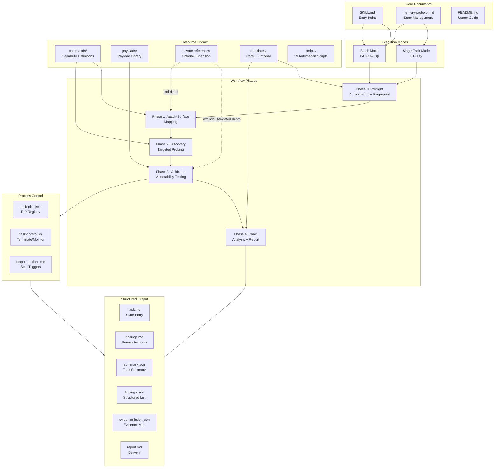
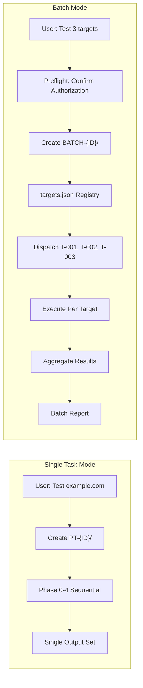
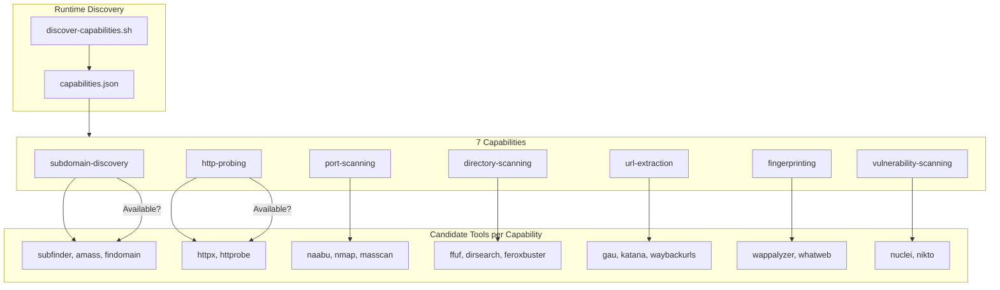
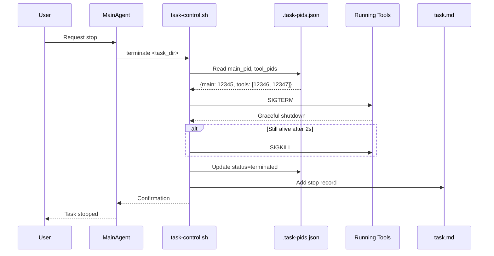
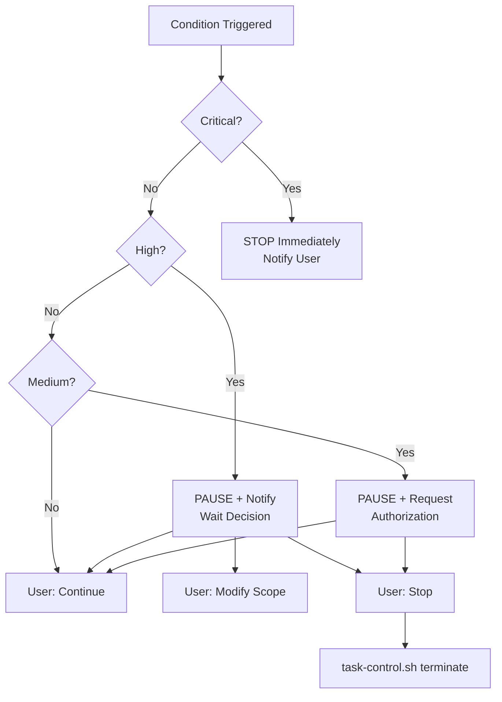
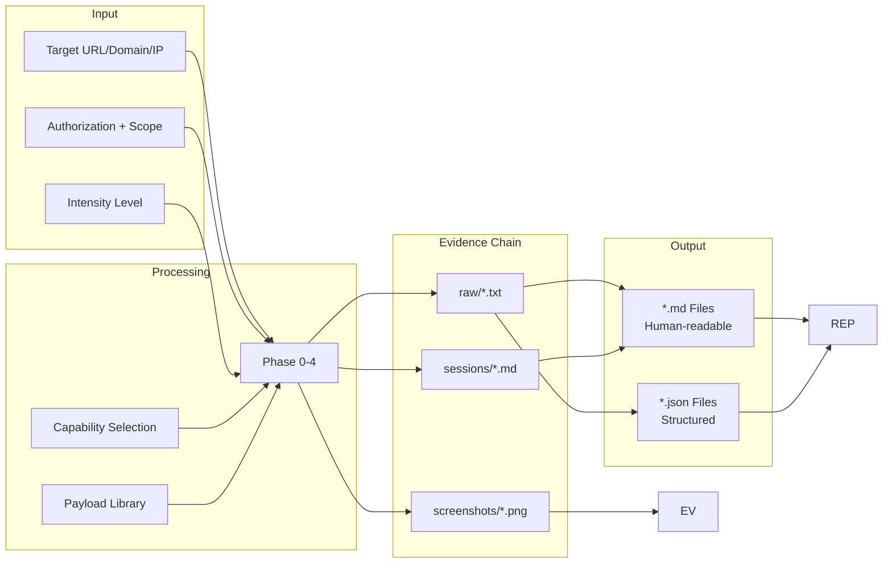
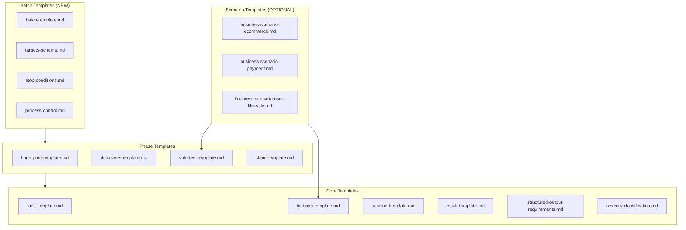
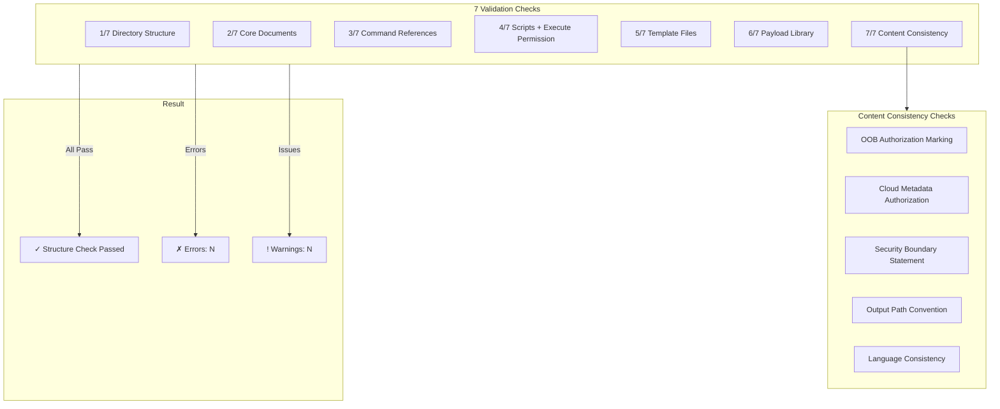
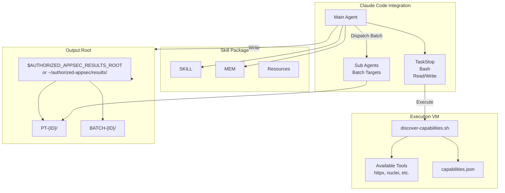

# Authorized AppSec Skill Architecture

> **Version**: 2.21.0 | **Updated: 2026-06-18**

---

## Overall Architecture



---

## Directory Structure

```text
authorized-appsec/
│
├── SKILL.md                      # Main entry point, workflow definition
├── memory-protocol.md            # State management, batch protocol
├── README.md                     # Usage guide, quick reference
│
├── agents/                       # External agent integration configs
│   └── openai.yaml               # OpenAI agent trigger/anti-trigger rules
├── commands/                     # Capability-first definitions
│   ├── capabilities.md           # 11 capabilities, candidate discovery
│   ├── recon.md                  # Recon workflow + OSINT methodology
│   ├── ports.md                  # Web port selection
│   ├── stack-mapping.md          # Tech stack → vulnerability class mapping
│   ├── threat-modeling.md        # STRIDE threat modeling guide
│   ├── source-code-review.md     # Source code review methodology
│   ├── brute-force.md            # Credential testing boundaries
│   ├── modern-auth.md            # OTP, slider, SSO, MFA, token lifecycle
│   └── authenticated-testing.md  # Authenticated coverage branch
│
├── payloads/                     # Vulnerability-specific payloads
│   ├── api-auth.md               # API authentication
│   ├── api-business-logic.md     # Business logic flaws
│   ├── api-cmdi.md               # API command injection
│   ├── api-config.md             # API configuration exposure
│   ├── api-data-exposure.md      # Data leakage, mass assignment
│   ├── api-graphql.md            # GraphQL security
│   ├── api-mobile.md             # Mobile API testing
│   ├── api-nosqli.md             # NoSQL injection
│   ├── api-sqli.md               # API SQL injection
│   ├── api-ssrf.md               # API SSRF
│   ├── api-xxe.md                # API XXE
│   ├── admin-panel.md            # Admin interface testing
│   ├── backup-exposure.md        # Backup/source code exposure
│   ├── cache-poisoning.md        # Web cache poisoning
│   ├── client-side-review.md     # Client-side secret/logic discovery
│   ├── cloud-security.md         # Cloud storage/metadata testing
│   ├── cors.md                   # CORS misconfiguration
│   ├── crlf-injection.md         # CRLF injection
│   ├── csrf.md                   # CSRF tokens, SameSite
│   ├── default-credentials.md     # Default credential testing
│   ├── deserialization.md        # Deserialization attacks
│   ├── dom-xss.md                # DOM-based XSS
│   ├── error-handling.md          # Error handling, information disclosure
│   ├── file-inclusion.md         # LFI/RFI
│   ├── file-read.md              # Arbitrary file read
│   ├── file-upload.md            # File upload bypass
│   ├── host-header.md            # Host header injection
│   ├── http-methods.md           # HTTP method testing
│   ├── http-smuggling.md         # HTTP request smuggling
│   ├── idor.md                   # IDOR/BOLA
│   ├── jwt.md                    # JWT attacks
│   ├── ldap-injection.md         # LDAP injection
│   ├── mfa-bypass.md             # MFA/2FA bypass
│   ├── oauth.md                  # OAuth flows
│   ├── open-redirect.md          # Open redirect
│   ├── password-policy.md         # Password policy, account lockout
│   ├── password-reset.md         # Password reset flaws
│   ├── path-traversal.md         # Path/directory traversal
│   ├── prototype-pollution.md    # Prototype pollution
│   ├── race-condition.md         # Race condition / TOCTOU
│   ├── rate-limiting.md          # Rate limit bypass
│   ├── security-headers.md       # CSP, security headers bypass
│   ├── session-management.md      # Session fixation, timeout, attributes
│   ├── soap-wsdl.md              # SOAP/WSDL web service testing
│   ├── sqli.md                   # SQL injection
│   ├── ssrf.md                   # SSRF
│   ├── ssti.md                   # Server-side template injection
│   ├── subdomain-takeover.md     # Subdomain takeover
│   ├── websocket.md              # WebSocket security
│   ├── xss.md                    # Cross-site scripting
│   └── xxe.md                    # XXE attacks
│
├── templates/                    # Output templates
│   ├── task-template.md          # Single task structure
│   ├── findings-template.md      # Finding format
│   ├── session-template.md       # Session records
│   ├── result-template.md        # Report format
│   ├── fingerprint-template.md   # Phase 0 output
│   ├── discovery-template.md     # Phase 1-2 output
│   ├── vuln-test-template.md     # Phase 3 log
│   ├── chain-template.md         # Phase 4 analysis
│   ├── severity-classification.md # Severity criteria
│   ├── structured-output-requirements.md # JSON schemas
│   ├── coverage-checklist.md     # Coverage gate before reporting
│   ├── batch-template.md         # Batch workflow (NEW)
│   ├── targets-schema.md         # targets.json schema (NEW)
│   ├── stop-conditions.md        # Stop condition definitions
│   ├── process-control.md        # Termination protocol (NEW)
│   ├── retest-template.md        # Retest verification workflow (NEW)
│   ├── rules-of-engagement.md    # Pre-engagement authorization template (NEW)
│   ├── cleanup-template.md       # Cleanup and rollback protocol (NEW)
│   ├── business-scenario-ecommerce.md    # E-commerce flow (OPTIONAL)
│   ├── business-scenario-payment.md      # Payment flow (OPTIONAL)
│   ├── business-scenario-sensitive-reporting.md # Informant/reporting workflows (OPTIONAL)
│   └── business-scenario-user-lifecycle.md # User lifecycle (OPTIONAL)
│
├── scripts/                      # Automation scripts
│   ├── discover-capabilities.sh  # VM tool discovery
│   ├── ensure_structured_outputs.py # JSON sync
│   ├── generate_report.py        # Report generation
│   ├── check-structure.sh        # Self-validation
│   ├── check-task.sh             # Running task health check
│   ├── task-control.sh           # Process termination
│   ├── init_task.py              # Single task directory initialization
│   ├── init_batch.py             # Batch directory initialization
│   ├── aggregate_batch.py        # Batch result aggregation
│   ├── generate_batch_report.py  # Batch report generation
│   ├── import_report.py          # Legacy report import
│   ├── auto_l3_hypotheses.py     # Historical hypothesis generation
│   ├── export_to_l3.py           # L3 knowledge export
│   ├── retrieve_l3.py            # L3 knowledge retrieval
│   ├── capture_evidence.py       # Evidence capture helper
│   ├── exploit_search.py         # Local exploit reference search
│   ├── cleanup.sh                # Test artifact cleanup and rollback
│   ├── smoke-test.sh             # Quick validation smoke test
│   └── build-public-package.sh   # Public release archive builder
│
└── Optional private extensions   # Not part of the public release
    ├── references/               # Private deep methodology, user-gated
    └── l3/                       # Private historical hypotheses
```

---

## Execution Mode Comparison



| Aspect | Single Task | Batch Mode |
|--------|-------------|------------|
| Entry | `SKILL.md` | `templates/batch-template.md` |
| Authorization | Per-task confirm | Unified preflight |
| Output Root | `PT-{ID}/` | `BATCH-{ID}/targets/T-{ID}/` |
| State Tracking | `task.md` | `batch.md` + `targets.json` |
| Process Control | `.task-pids.json` | Per-target `.task-pids.json` |
| Report | Single `report.md` | Batch `report.md` + per-target |

---

## Capability-First Tool Selection



**Selection Rules**:
1. Discover tools inside execution VM at runtime
2. Select first available candidate per capability
3. If none available → record limitation, use manual alternative
4. Never hardcode specific tool names

---

## Process Control Architecture



**Termination Flow**:
```text
1. Read .task-pids.json → Get PIDs
2. SIGTERM (graceful) → Wait 2 seconds
3. If alive → SIGKILL (force)
4. Update status in:
   - .task-pids.json (terminated)
   - task.md (stop record)
   - targets.json (batch mode)
```

---

## Stop Condition Decision Tree



**21 Stop Conditions by Severity**:

| Severity | Conditions |
|----------|------------|
| **Critical** (5) | critical_finding, credential_or_token_exposure, mass_data_exposure, service_crash_risk, legal_concern_detected |
| **High** (5) | out_of_scope_target, service_instability, destructive_action_required, lateral_movement_risk, internal_probing_required |
| **Medium** (10) | scope_creep_detected, rate_limit_triggered, waf_block_detected, oob_required, cloud_metadata_required, authenticated_testing_required, persistence_risk, tool_failure_critical, network_unreachable, dns_resolution_failed |
| **Low** (1) | ssl_certificate_invalid (continue with warning) |

---

## Data Flow Architecture



**Output Relationships**:

| File | Authority | Purpose |
|------|-----------|---------|
| `findings.md` | Primary | Human-readable confirmed findings |
| `findings.json` | Projection | Structured list for aggregation |
| `task.md` | Entry | Resume state, next actions |
| `summary.json` | Summary | Task-level metadata |
| `evidence-index.json` | Index | Evidence → Raw file mapping |
| `report.md` | Delivery | Final report for stakeholder |

---

## Template Dependencies



---

## Self-Check Architecture



---

## Integration Points



---

## Summary

| Component | Count | Purpose |
|-----------|-------|---------|
| Core Documents | 3 | Entry, protocol, usage |
| Commands | 9 | Capability definitions, recon, ports, stack mapping, threat modeling, source review, brute-force, modern-auth, authenticated-testing |
| Payloads | 55 | Vulnerability-specific safe payloads |
| Private References | Not published | Optional local extension; explicitly user-gated when present |
| Core Templates | 23 | Output formatting, batch control, retest, RoE, cleanup, coverage checklist |
| Optional Templates | Current library | Business scenarios |
| Scripts | 19 | Discovery, validation, control, report, batch, L3, init, cleanup, smoke test, release packaging |
| Capabilities | 12 | Runtime tool selection |
| Stop Conditions | Current library | Unified termination triggers |
| Execution Modes | 2 | Single task, batch |

**Key Design Principles**:
1. **Capability-first**: Tools discovered at runtime, not hardcoded
2. **File-based state**: Memory protocol for context management
3. **Tiered validation**: Default safe (payloads/) in normal flow → private deep methodology only on explicit user request
4. **Evidence-driven**: Every finding backed by raw evidence
5. **Process control**: Force termination via PID tracking
6. **Self-validating**: Structure check with content consistency
7. **Layered knowledge**: Safe payloads by default → private deep methodology only when explicitly requested → L3 historical hypotheses
