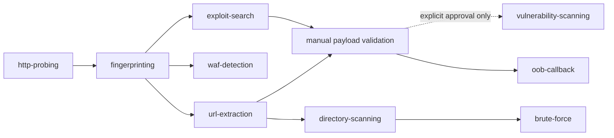
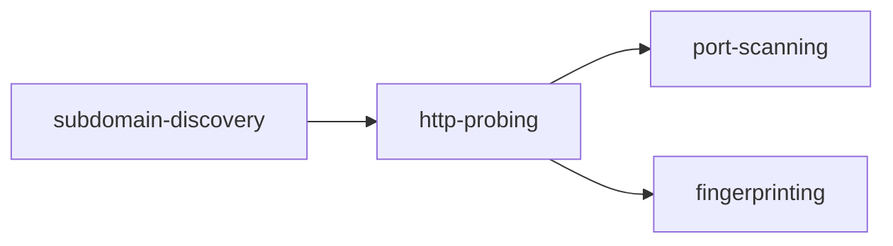
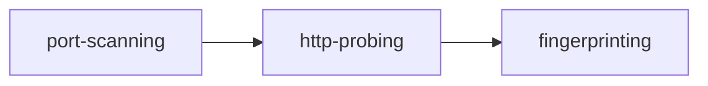

# Authorized AppSec Capabilities

> **Version**: 2.21.0 | **Updated**: 2026-06-18

This document defines capabilities, not tools. The skill discovers available tools inside the Kali Linux VM or equivalent execution VM and selects the best candidate for each capability.

## Capability Discovery

Before using any capability, discover available tools inside the VM and write the result into the active task directory:

```bash
# Run inside the Kali VM or equivalent execution VM
./scripts/discover-capabilities.sh <task_dir>/capabilities.json
```

Output: `<task_dir>/capabilities.json` with available tools per capability.

If no tool is available for a capability:
- Record the limitation in `task.md`
- Skip that capability or use manual alternatives
- Do not assume specific tool names exist

---

## Capability Definitions

### 1. subdomain-discovery

**Purpose**: Enumerate subdomains for a given domain.

**Output**: List of subdomains (FQDNs).

**Candidate Discovery** (inside VM):

```bash
# Try common candidates in order
for tool in subfinder amass findomain assetfinder; do
  if command -v "$tool" >/dev/null 2>&1; then
    echo "$tool: available"
  fi
done
```

**Execution Template** (adapt to discovered tool):

```bash
# Generic pattern - adapt flags to discovered tool
<tool> -d <domain> -o <output_file>
```

**Common Flags Reference**:

| Tool | Basic | All Sources | Recursive | Rate Limit |
|------|-------|-------------|-----------|------------|
| subfinder | `-d domain -silent` | `-all` | `-recursive` | `-rl 100` |
| amass | `enum -d domain` | `-passive` | `-brute` | See docs |
| findomain | `-t domain` | `--all` | N/A | Built-in |
| assetfinder | `domain` | N/A | N/A | N/A |

**Intensity Mapping**:

| Intensity | Behavior |
|-----------|----------|
| passive | Use only passive sources, no brute |
| gentle | Passive + limited rate |
| standard | All sources + recursive if supported |

---

### 2. http-probing

**Purpose**: Probe HTTP services, detect status, title, technology stack.

**Output**: List of alive URLs with metadata (status, title, tech, server).

**Candidate Discovery** (inside VM):

```bash
for tool in httpx httprobe httpcat; do
  if command -v "$tool" >/dev/null 2>&1; then
    echo "$tool: available"
  fi
done
```

**Execution Template**:

```bash
# Input: URLs or hosts
<tool> -l <input_file> -p <ports> -tech-detect -title -status-code -o <output>
```

**Common Flags Reference**:

| Tool | Tech Detect | Title | Ports | JSON | Rate |
|------|-------------|-------|-------|------|------|
| httpx | `-tech-detect` | `-title` | `-p 80,443` | `-json` | `-rate-limit 50` |
| httprobe | N/A | N/A | `-p` (limited) | N/A | N/A |
| httpcat | `-tech-detect` | `-title` | `-p` | `-json` | `-rate` |

---

### 3. port-scanning

**Purpose**: Discover open ports on hosts.

**Output**: Host:port pairs.

**Candidate Discovery** (inside VM):

```bash
for tool in naabu nmap masscan rustscan; do
  if command -v "$tool" >/dev/null 2>&1; then
    echo "$tool: available"
  fi
done
```

**Execution Template**:

```bash
<tool> -iL <hosts_file> -p <ports> -o <output_file>
```

**Common Flags Reference**:

| Tool | Top Ports | Custom Ports | Rate | Passive | JSON |
|------|-----------|--------------|------|---------|------|
| naabu | `-top-ports 100` | `-p 80,443` | `-rate 100` | `-passive` | `-json` |
| nmap | `-F` | `-p` | `-T3` | N/A | `-oG` |
| masscan | `--top-ports` | `-p` | `--rate` | N/A | `-oL` |
| rustscan | `-` | `-p` | `--ulimit` | N/A | `-o json` |

**Intensity Mapping**:

| Intensity | Behavior |
|-----------|----------|
| passive | Use passive mode if available, no SYN |
| gentle | Low rate, CONNECT scan, top-ports |
| standard | Normal rate, top-100 or custom |

---

### 4. directory-scanning

**Purpose**: Discover hidden paths, directories, files.

**Output**: URLs with status codes.

**Candidate Discovery** (inside VM):

```bash
for tool in spray ffuf dirsearch feroxbuster gobuster; do
  if command -v "$tool" >/dev/null 2>&1; then
    echo "$tool: available"
  fi
done
```

**Execution Template**:

```bash
<tool> -u <url> -w <wordlist> -o <output_file>
```

**Wordlist Discovery**:

```bash
# Find available wordlists
find /usr/share -name "*.txt" -path "*wordlist*" 2>/dev/null | head -20
find /opt -name "*.txt" -path "*wordlist*" 2>/dev/null | head -20
ls -la ~/.wordlists/ 2>/dev/null
```

If no wordlist found: record limitation, skip directory-scanning.

**Intensity Mapping**:

| Intensity | Threads | Rate |
|-----------|---------|------|
| gentle | 5 | 10 req/s |
| standard | 10-20 | 50 req/s |

---

### 5. url-extraction

**Purpose**: Extract URLs from web pages and JavaScript files.

**Output**: List of discovered URLs and endpoints.

**Candidate Discovery** (inside VM):

```bash
for tool in URLFinder gau katana waybackurls; do
  if command -v "$tool" >/dev/null 2>&1; then
    echo "$tool: available"
  fi
done
```

**Execution Template**:

```bash
<tool> -u <url> -o <output_file>
```

**Intensity Mapping**:

| Intensity | Depth |
|-----------|-------|
| gentle | 1-2 levels |
| standard | 3 levels |

---

### 6. fingerprinting

**Purpose**: Identify web application frameworks, CMS, libraries.

**Output**: Identified technologies with versions.

**Candidate Discovery** (inside VM):

```bash
for tool in Ehole wappalyzer whatweb builtwith; do
  if command -v "$tool" >/dev/null 2>&1; then
    echo "$tool: available"
  fi
done
```

**Execution Template**:

```bash
<tool> -u <url> -o <output_file>
```

---

### 7. vulnerability-scanning

**Purpose**: Scan for known vulnerabilities, misconfigurations, exposures.

**Output**: Findings with severity, template, evidence.

**Default: not invoked.** This capability is **opt-in only**. Detecting that a scanner (nuclei/nikto/wpscan) is installed does not mean it should run. Only invoke this capability when the user explicitly requests nuclei/scanner-based CVE or template scanning and that approval is recorded in `task.md`. Otherwise, validate vulnerabilities via manual payload testing from `payloads/`. A fingerprint tag, L3 hypothesis, or discovery result never authorizes running these scanners.

**Candidate Discovery** (inside VM):

```bash
for tool in nuclei nikto wpscan; do
  if command -v "$tool" >/dev/null 2>&1; then
    echo "$tool: available"
  fi
done

# Check for nuclei templates
if command -v nuclei >/dev/null 2>&1; then
  nuclei -tl | head -20  # List available templates
fi
```

**Execution Template**:

```bash
# Targeted scan based on fingerprint
<tool> -u <url> -tags <tags> -severity <levels> -o <output_file>
```

**Tag Discovery** (if nuclei available):

```bash
nuclei -tl | grep -E "<fingerprint_keyword>"
```

---

### 8. exploit-search

**Purpose**: Search for known exploits matching identified software and versions.

**Output**: List of relevant CVEs and exploit code paths (EDB-ID, CVE numbers).

**Candidate Discovery** (inside VM):

```bash
for tool in searchsploit findsploit; do
  if command -v "$tool" >/dev/null 2>&1; then
    echo "$tool: available"
  fi
done
```

**Execution Template**:

```bash
# Search for exploits matching a specific software/version
searchsploit <software> <version>

# Example: searchsploit EmpireCMS 7.0
# Example: searchsploit Apache 2.4.39
# Example: searchsploit PHP 5.4
```

**Intensity Mapping**:

| Intensity | Behavior |
|-----------|----------|
| standard | Search each confirmed software version |
| aggressive | Search all suspected versions + broader keyword matches |

---

### 9. waf-detection

**Purpose**: Detect WAF/CDN presence that may interfere with payload delivery.

**Output**: WAF vendor name or "none detected".

**Candidate Discovery** (inside VM):

```bash
for tool in wafw00f; do
  if command -v "$tool" >/dev/null 2>&1; then
    echo "$tool: available"
  fi
done
```

**Execution Template**:

```bash
<tool> <url> -o <output_file>
```

**Manual Alternative**: Send a deliberately malicious payload (e.g., `<script>alert(1)</script>`, `' OR 1=1--`) and check if it's rejected differently than invalid but benign input.

---

### 10. brute-force

**Purpose**: Password and credential brute-force against login forms, HTTP auth, and services.

**Output**: Valid credentials or confirmation of password policy.

**Candidate Discovery** (inside VM):

```bash
for tool in hydra medusa ncrack patator; do
  if command -v "$tool" >/dev/null 2>&1; then
    echo "$tool: available"
  fi
done
```

**Execution — See `commands/brute-force.md` for full workflow, dictionary selection, and safety rules.**

---

### 11. oob-callback

**Purpose**: Receive explicit out-of-band callback evidence for blind SSRF, XXE, deserialization, command injection, or similar validation.

**Authorization**: Requires explicit user approval before use. Record callback domain, data retained, allowed payload class, and stop condition in `task.md`.

**Candidate Discovery** (inside VM):

```bash
for tool in interactsh-client dnslog-client ceye burp-collaborator-client; do
  if command -v "$tool" >/dev/null 2>&1; then
    echo "$tool: available"
  fi
done
```

**Execution Template**:

```bash
# Generic pattern - adapt to discovered tool and approved provider
<tool> -o <callback_log>
```

**Boundary**:

- Use OOB only to prove that the target made a callback.
- Do not exfiltrate file contents, credentials, cloud metadata, or response bodies through OOB.
- Stop after one minimal callback proof per vulnerability class unless the user approves additional bounded validation.

---

### 12. headless-browser

**Purpose**: Execute JavaScript, interact with SPA pages, capture DOM state, validate client-side vulnerabilities (DOM XSS, client-side template injection), extract dynamic API endpoints, obtain tokens from modern login flows (OTP, slider, SSO).

**When to activate**: Phase 0/1 fingerprint detects SPA indicators:
- HTML contains `<div id="app">` or `<div id="root">` with no visible content
- JS bundles named with chunk hashes (`app.a3f2b1.js`, `vendor.c4d5e6.js`)
- `__NEXT_DATA__`, `__NUXT__`, `window.__VUE__`, or similar framework hydration markers
- Source map files (`.js.map`) exposed
- Service Worker registration
- Login flow involves CAPTCHA, QR scan, OTP, or SSO redirect

**Candidate Discovery** (inside VM):

```bash
for tool in playwright npx-playwright puppeteer chromedp selenium; do
  if command -v "$tool" >/dev/null 2>&1; then
    echo "$tool: available"
  fi
done
# Also check:
python3 -c "from playwright.sync_api import sync_playwright; print('playwright available')" 2>/dev/null
node -e "require('puppeteer'); console.log('puppeteer available')" 2>/dev/null
```

**Execution Template**:

```bash
# Playwright (preferred)
python3 -c "
from playwright.sync_api import sync_playwright
with sync_playwright() as p:
    browser = p.chromium.launch()
    page = browser.new_page()
    page.goto('<target_url>')
    page.wait_for_load_state('networkidle')
    # Extract rendered HTML
    html = page.content()
    # Extract all API calls
    # Extract localStorage/sessionStorage tokens
    print(html)
    browser.close()
"
```

**HAR Integration**: Capture evidence via Playwright tracing:

```bash
# Start tracing → perform actions → stop → export HAR
context.tracing.start(screenshots=True, snapshots=True, sources=True)
# ... perform test actions ...
context.tracing.stop(path='raw/trace.zip')
# Then import HAR into capture_evidence.py:
python3 scripts/capture_evidence.py <task_dir> import-har --input raw/trace.zip
```

**Degraded Mode** (no headless browser available):

When headless-browser capability is absent but SPA is detected, fall back to:
1. `curl` + parse static HTML for API endpoints in `<script>` tags
2. Download and parse JS source maps (`.js.map`) for route definitions
3. Extract endpoints from `__NEXT_DATA__`, `__NUXT__` hydration data
4. Use `url-extraction` capability on discovered JS files
5. Record limitation: "SPA detected, headless browser unavailable — dynamic routes and client-side logic not fully tested"

Record the degraded mode status in `task.md`:

```md
## Capability Limitations
- headless-browser: UNAVAILABLE — SPA detected, using static JS analysis fallback
  Impact: dynamic API routes, DOM XSS, client-side auth flows NOT fully tested
```

**Intensity Mapping**:

| Intensity | Behavior |
|-----------|----------|
| passive | No browser; static HTML/JS analysis only |
| gentle | Open pages, read DOM, extract tokens; no interaction |
| standard | Full interaction: click, fill forms, navigate SPA routes |

---

## Capability Composition

Real tasks combine multiple capabilities. The skill orchestrates based on discovered tools:

### URL Task



### Domain Task



### IP Range Task



---

## AI Selection Rules

When multiple candidates exist for a capability:

1. Prefer tools with better output format (JSON support)
2. Prefer tools with rate control for gentle intensity
3. Prefer passive modes for passive intensity
4. If primary candidate fails, try next candidate
5. If all candidates fail, record limitation and use manual approach

Record the selected tool in `task.md`:

```md
## Tools Used

- subdomain-discovery: subfinder (available, selected)
- http-probing: httpx (available, selected)
- port-scanning: naabu (unavailable, skipped)
```

---

## Missing Capability Handling

If no tool available:

| Capability | Manual Alternative |
|------------|-------------------|
| subdomain-discovery | Certificate transparency logs, DNS brute via dig |
| http-probing | curl/wget with manual parsing |
| port-scanning | nc/netcat manual probe |
| directory-scanning | curl with manual wordlist iteration |
| url-extraction | grep/regex on HTML/JS source |
| fingerprinting | HTTP header + HTML pattern analysis |
| vulnerability-scanning | Manual payload testing from payloads/ |
| exploit-search | Google / Exploit-DB / NVD website search |
| waf-detection | Manual payload comparison (malicious vs benign) |
| brute-force | curl with while-read loop (see commands/brute-force.md) |
| oob-callback | User-provided callback endpoint and manual log review |
| headless-browser | curl + JS source map parsing + hydration data extraction; see degraded mode above |

---

## Capability Registry Format

`capabilities.json` (generated by discover-capabilities.sh):

```json
{
  "vm_id": "vm-001",
  "discovered_at": "2026-05-03T12:00:00Z",
  "capabilities": {
    "subdomain-discovery": {
      "candidates": ["subfinder", "amass"],
      "binary_paths": ["/usr/bin/subfinder", "/usr/bin/amass"],
      "selected": "subfinder",
      "selected_path": "/usr/bin/subfinder",
      "requires_explicit_approval": false
    },
    "http-probing": {
      "candidates": ["httpx"],
      "selected": "httpx"
    },
    "port-scanning": {
      "candidates": [],
      "selected": null
    },
    "vulnerability-scanning": {
      "candidates": ["nuclei"],
      "selected": "nuclei",
      "requires_explicit_approval": true,
      "approval_reason": "Template-based scanners (nuclei/nikto/wpscan) run only on explicit user request per SKILL.md Nuclei Policy"
    }
  },
  "mcp_server": null,
  "wordlists": ["/usr/share/seclists/Discovery/Web-Content/common.txt"],
  "nuclei_templates": []
}
```

Field notes:

- `binary_paths` / `selected_path`: absolute paths to the discovered binaries, for direct invocation.
- `requires_explicit_approval` + `approval_reason`: present on `vulnerability-scanning`, `brute-force`, `oob-callback`, and `k8s-client`. `"available"` does **not** mean `"may run"` — these capabilities still need explicit user opt-in per their policy.
- `nuclei_templates`: sample of available nuclei template names (empty when nuclei is not installed or not requested). Listed for awareness only; it never authorizes running nuclei.
