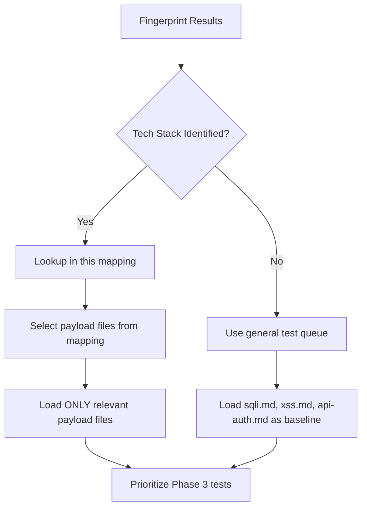

# Tech Stack to Vulnerability Mapping

> **Version**: 2.21.0 | **Updated**: 2026-06-18
>
> **Purpose**: Map detected technology stacks to likely vulnerability classes, enabling targeted testing after fingerprinting.

---

## Usage

During Phase 0 (fingerprint), identify the tech stack. Then use this mapping to:
1. Prioritize which `payloads/*.md` files to load
2. Focus Phase 1 discovery on relevant endpoints
3. Inform Phase 3 validation test selection

**Do not load all payload files.** Use this mapping to select only the relevant file(s).

This mapping is not a fingerprint source. Use it only after current-task evidence identifies a technology through headers, cookies, HTML/JS, error output, source/package metadata, service banners, or raw responses. Do not select ThinkPHP, Spring, Nacos, or any other stack from path shape, L3 history, or a previous user-provided case alone.

---

## Web Servers

| Technology | Key Vulnerability Classes | Payload Files |
|------------|--------------------------|---------------|
| Apache HTTPD | Path traversal, SSRF via mod_proxy, .htaccess misconfig | `ssrf.md`, `file-inclusion.md`, `file-read.md` |
| Nginx | Misconfig alias/path traversal, host header routing, off-by-slash | `host-header.md`, `file-read.md`, `ssrf.md` |
| IIS | Path traversal (encoding), auth bypass, Web.config exposure | `file-read.md`, `api-auth.md` |
| Apache Tomcat | Manager app exposure, CVE-prone versions, WAR upload | `file-upload.md`, `api-auth.md`, `api-config.md` |
| LiteSpeed | Config exposure, path normalization | `api-config.md`, `file-read.md` |

---

## Application Frameworks

| Technology | Key Vulnerability Classes | Payload Files |
|------------|--------------------------|---------------|
| Spring Boot | Actuator exposure, SpEL injection, deserialization | `api-config.md`, `ssti.md`, `deserialization.md` |
| Spring Framework | CVE-driven (check version), path traversal | `file-read.md`, `ssrf.md` |
| Django | Debug mode, SECRET_KEY exposure, admin panel | `api-config.md`, `api-data-exposure.md`, `api-auth.md` |
| Flask | Debug mode, Jinja2 SSTI, SECRET_KEY in source | `ssti.md`, `api-config.md`, `api-data-exposure.md` |
| Ruby on Rails | Secret token, mass assignment, path traversal, SSRF | `api-data-exposure.md`, `ssrf.md`, `file-read.md` |
| Laravel | .env exposure, debug mode, Mass Assignment, token leakage | `api-config.md`, `api-data-exposure.md`, `api-auth.md` |
| Express.js | Prototype pollution, debug routes, CORS misconfig | `prototype-pollution.md`, `cors.md`, `api-config.md` |
| ASP.NET | ViewState deserialization, path traversal, auth cookie | `deserialization.md`, `file-read.md`, `api-auth.md` |
| PHP | LFI/RFI, deserialization, file upload, config exposure | `file-inclusion.md`, `deserialization.md`, `file-upload.md`, `api-config.md` |
| FastAPI/Starlette | OpenAPI exposure, CORS, auth misconfig | `api-config.md`, `cors.md`, `api-auth.md` |
| Struts2 | OGNL injection, RCE (check CVEs) | `ssti.md`, `api-cmdi.md` |
| ThinkPHP | RCE, file inclusion, SQL injection | `sqli.md`, `file-inclusion.md`, `api-cmdi.md` |

---

## Data Stores

| Technology | Key Vulnerability Classes | Payload Files |
|------------|--------------------------|---------------|
| MySQL | SQL injection, information_schema, INTO OUTFILE | `sqli.md`, `api-sqli.md` |
| PostgreSQL | SQL injection, COPY command, large object | `sqli.md`, `api-sqli.md` |
| MongoDB | NoSQL injection, SSRF (PDF), auth misconfig | `api-nosqli.md`, `ssrf.md`, `api-auth.md` |
| Redis | Unauth access, SSRF, Lua sandbox escape | `ssrf.md`, `api-config.md` |
| Elasticsearch | Unauth API, query injection, file read via pipeline | `api-data-exposure.md`, `api-config.md`, `file-read.md` |
| Memcached | Unauth access, SSRF reflection | `ssrf.md`, `api-config.md` |
| MSSQL | SQL injection, xp_cmdshell, CLR assembly | `sqli.md`, `api-sqli.md`, `api-cmdi.md` |
| Oracle | SQL injection, PL/SQL injection, UTL_HTTP SSRF | `sqli.md`, `ssrf.md` |

---

## Authentication & Session

| Technology | Key Vulnerability Classes | Payload Files |
|------------|--------------------------|---------------|
| JWT | None algorithm, weak key, algorithm confusion, kid injection | `jwt.md` |
| OAuth 2.0 | Redirect URI bypass, state parameter, token leakage | `oauth.md` |
| SAML | XML signature wrapping, assertion replay | `xxe.md`, `api-auth.md` |
| LDAP | LDAP injection, auth bypass | `ldap-injection.md` |
| Session cookies | Secure/HttpOnly flags, fixation, hijacking, timeout, attributes | `session-management.md`, `cors.md`, `api-auth.md` |
| MFA/2FA | OTP bypass, step skipping, brute force, rate limit | `mfa-bypass.md`, `rate-limiting.md` |
| Password reset | Token prediction, expiration bypass, host header | `password-reset.md`, `host-header.md` |
| Password policy | Complexity enforcement, lockout thresholds, history | `password-policy.md` |
| Default credentials | Platform defaults, no-auth services | `default-credentials.md` |
| Admin panels | Path discovery, default auth, debug consoles | `admin-panel.md` |

---

## Cloud & Infrastructure

| Technology | Key Vulnerability Classes | Payload Files |
|------------|--------------------------|---------------|
| AWS (metadata) | SSRF to 169.254.169.254, IAM credential leak, S3 misconfig | `cloud-security.md`, `ssrf.md`, `api-ssrf.md` |
| GCP (metadata) | SSRF to metadata.google.internal, GCS misconfig | `cloud-security.md`, `ssrf.md`, `api-ssrf.md` |
| Azure (metadata) | SSRF to 169.254.169.254, IMDS, Blob misconfig | `cloud-security.md`, `ssrf.md`, `api-ssrf.md` |
| Kubernetes | API server exposure, etcd, dashboard, RBAC | `api-auth.md`, `api-config.md` |
| Docker | API exposure, registry, container escape | `api-config.md`, `api-auth.md` |
| Cloud security | S3/GCS/Azure Blob enumeration, metadata, buckets | `cloud-security.md` |
| Error handling | Stack traces, debug modes, verbose errors | `error-handling.md` |
| Backup exposure | .git/.svn/.env, backup files, config exposure | `backup-exposure.md` |
| Path traversal | Directory traversal, encoding bypass, local file access | `path-traversal.md` |
| Client-side review | JS secrets, localStorage, hardcoded credentials | `client-side-review.md` |
| CDN / WAF | Bypass techniques, origin IP disclosure, HTTP methods | `http-methods.md`, `host-header.md`, `cors.md` |

---

## API Technologies

| Technology | Key Vulnerability Classes | Payload Files |
|------------|--------------------------|---------------|
| GraphQL | Introspection, depth attack, batch mutation, injection | `api-graphql.md` |
| REST API | IDOR/BOLA, auth bypass, rate limiting, business logic | `idor.md`, `api-auth.md`, `rate-limiting.md`, `api-business-logic.md` |
| SOAP/XML | XXE, WSDL exposure, command injection | `xxe.md`, `api-xxe.md`, `api-cmdi.md`, `soap-wsdl.md` |
| WebSocket | Missing auth, origin bypass, injection via WS | `websocket.md` |
| Mobile API | Certificate pinning, versioning, mobile-specific headers | `api-mobile.md` |
| gRPC | Proto exposure, auth, deserialization | `grpc-protobuf.md`, `api-auth.md`, `deserialization.md` |
| HTTP/2 | Single-packet race condition, multiplexing abuse | `http2-single-packet.md`, `race-condition.md` |
| SSE (Server-Sent Events) | Auth on event stream, data leakage, injection | `websocket.md`, `api-auth.md`, `api-data-exposure.md` |

---

## AI / LLM Stack

| Detection Signal | Technology | Payload Files |
|---|---|---|
| `/api/chat`, `/api/completion`, `/v1/chat/completions` | OpenAI-compatible API | `ai-security.md` |
| `X-LLM-*` headers, `model` in response JSON | LLM proxy/gateway | `ai-security.md` |
| `/v1/embeddings`, vector search endpoints | RAG / vector database | `ai-security.md` |
| Tool/function calling in API schema | LLM with tool use | `ai-security.md` |
| LangChain/LlamaIndex in stack trace or source | LLM framework | `ai-security.md`; optional private deep notes if maintained locally and explicitly requested |
| Chat widget with AI responses | Customer-facing chatbot | `ai-security.md` |

---

## gRPC Detection Signals

| Signal | Port | Note |
|---|---|---|
| `grpc-status` header in response | Various | gRPC service confirmed |
| `application/grpc` content type | Various | gRPC endpoint |
| `content-type: application/grpc-web+proto` | 443/80 | grpc-web (browser) |
| Server reflection on `grpc.reflection.v1.ServerReflection` | 50051, 6565 | Enables enumeration |
| Protobuf files in JS bundles / source maps | 443/80 | Extract service definitions |

---

## Cloud & Container Detection Signals

| Signal | Port | Technology | Payload Files |
|---|---|---|---|
| `/healthz`, `/livez`, `/readyz`, `/version` returning K8s format | 6443, 8443 | Kubernetes API server | `cloud-security.md` |
| `kubernetes.default.svc` in DNS/resolver | Internal | K8s internal | `cloud-security.md` |
| Kubelet `/pods` endpoint | 10250, 10255 | Kubelet API | `cloud-security.md` |
| etcd `/v2/keys` or `/v3/kv` | 2379 | etcd | `cloud-security.md` |
| `Aliyungf_TC` cookie, `Server: Tengine` | 443/80 | Alibaba Cloud WAF | `waf-origin-discovery.md` |
| `Server: EdgeOne`, `X-Cache-Lookup` | 443/80 | Tencent EdgeOne | `waf-origin-discovery.md` |
| `*.oss-{region}.aliyuncs.com` | 443 | Alibaba OSS | `cloud-security.md` |
| `*.cos.{region}.myqcloud.com` | 443 | Tencent COS | `cloud-security.md` |
| `*.obs.{region}.myhuaweicloud.com` | 443 | Huawei OBS | `cloud-security.md` |
| `http://100.100.100.200/latest/meta-data/` (SSRF target) | Internal | Alibaba Cloud metadata | `cloud-security.md` |
| `http://metadata.tencentyun.com/latest/meta-data/` (SSRF target) | Internal | Tencent Cloud metadata | `cloud-security.md` |

---

## SPA Detection Signals (trigger headless-browser capability)

| Signal | Framework | Action |
|---|---|---|
| `<div id="app">` with empty/no initial content | Vue.js | Activate `headless-browser` or degraded JS analysis |
| `<div id="root">` with JS bundle | React | Activate `headless-browser` or degraded JS analysis |
| `__NEXT_DATA__` script tag | Next.js | Extract from hydration data; load routes from `buildManifest.js` |
| `__NUXT__` script tag | Nuxt.js | Extract from hydration data |
| `.js.map` files accessible | Any SPA | Download and parse for route/component definitions |
| Vite chunk naming (`assets/index-*.js`) | Vite | Parse chunks for API route definitions |
| Service Worker (`navigator.serviceWorker`) | PWA | Check SW scope and fetch handler |
| Angular chunk (`main.*.js`, `polyfills.*.js`) | Angular | Extract routes from router config |

---

## Security Technologies

| Technology | Testing Focus | Payload Files |
|------------|---------------|---------------|
| WAF detected | Bypass patterns, encoding, fragmentation | `waf bypass techniques within relevant payload files` |
| CSP present | CSP bypass, directive weaknesses | `xss.md`, `dom-xss.md` |
| CORS headers | Origin reflection, null origin, subdomain trust | `cors.md` |
| Rate limiting | Rate limit bypass, race conditions | `rate-limiting.md`, `race-condition.md` |
| CSP + nonce | Inline script bypass alternatives | `xss.md` |
| Security headers | CSP bypass, X-Frame-Options, HSTS | `security-headers.md` |

---

## Priority Mapping Workflow

After Phase 0 fingerprint:



### Quick Priority Rules

1. If a version has a **known CVE with public exploit** → prioritize that vulnerability class as **High**
2. If **config/debug endpoints** are exposed → prioritize `api-config.md`, `api-data-exposure.md`, `error-handling.md`
3. If **authentication** is detected → prioritize `api-auth.md`, `jwt.md`, `mfa-bypass.md`, `oauth.md`
4. If **API endpoints** are found → prioritize `idor.md`, `rate-limiting.md`, `api-business-logic.md`, `soap-wsdl.md`
5. If **file upload** exists → prioritize `file-upload.md`, `deserialization.md`
6. If **database** is identifiable → prioritize `sqli.md` or `api-nosqli.md`
7. If **cloud infrastructure** detected → prioritize `cloud-security.md`, `ssrf.md`
8. If **security headers absent** → prioritize `security-headers.md`
9. If **web server with known defaults** → prioritize `default-credentials.md`, `admin-panel.md`
10. If **session cookies present** → prioritize `session-management.md`, `jwt.md`

### Example: Nacos Detected

```
Tech: Nacos (Spring Boot + Derby + Java)
→ Load: api-config.md, ssti.md, deserialization.md, api-auth.md, api-data-exposure.md
→ Priority: Actuator exposure, deserialization RCE, auth bypass
→ Also check: Known Nacos CVEs (user agent spoofing, identity bypass)
```

### Example: WordPress Detected

```
Tech: WordPress (PHP + MySQL)
→ Load: api-auth.md, sqli.md, file-upload.md, file-inclusion.md, api-config.md
→ Priority: Plugin/theme vulnerabilities, wp-admin auth, file upload
→ Also check: WP version CVEs, xmlrpc.php, wp-config.php exposure
```
