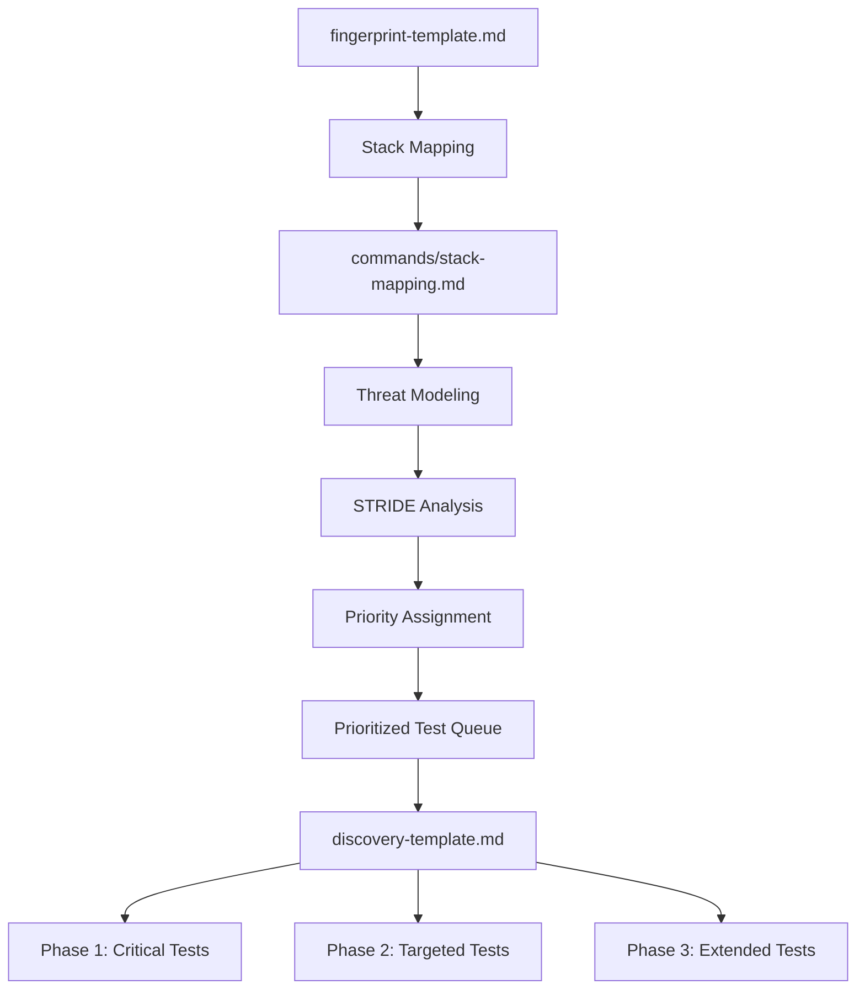

# Threat Modeling Guide

> **Version**: 2.8.1 | **Updated**: 2026-06-01
>
> **Purpose**: Systematic threat modeling methodology for authorized web application security assessment. Map fingerprint data to attack hypotheses and prioritize testing.

---

## Overview

Threat modeling translates fingerprint and reconnaissance data into a structured attack hypothesis. This guide helps you:

1. Identify threats using STRIDE methodology for web apps
2. Model data flows and trust boundaries
3. Generate attack surface hypotheses from fingerprint data
4. Prioritize tests based on threat model output
5. Feed prioritized test queue into `discovery-template.md`

**Reference**: Use `commands/stack-mapping.md` to map detected technologies to payload files.

---

## STRIDE Methodology for Web Applications

### STRIDE Threat Categories

| Threat | Description | Web App Examples | Payload Files |
|--------|-------------|-----------------|---------------|
| **S**poofing | Pretending to be another user or system | Authentication bypass, session hijacking, CSRF | `api-auth.md`, `jwt.md`, `session-management.md`, `cors.md` |
| **T**ampering | Unauthorized modification of data | IDOR, privilege escalation, parameter manipulation | `idor.md`, `api-business-logic.md`, `api-data-exposure.md` |
| **R**epudiation | Ability to deny actions | Missing audit logs, action tracing gaps | `api-auth.md`, `session-management.md` |
| **I**nformation Disclosure | Exposing data to unauthorized parties | Error leakage, verbose responses, path disclosure, backup exposure | `error-handling.md`, `backup-exposure.md`, `client-side-review.md`, `security-headers.md` |
| **D**enial of Service | Making system unavailable | Rate limit absence, resource exhaustion | `rate-limiting.md` |
| **E**levation of Privilege | Gaining unauthorized access levels | Admin bypass, vertical privilege escalation | `admin-panel.md`, `api-auth.md`, `password-policy.md` |

---

## Data Flow Diagrams

### Creating a Data Flow Diagram

For each target, create a data flow diagram identifying:

1. **External entities**: Users, browsers, mobile apps, third-party services
2. **Processes**: Web server, application server, API gateway, authentication service
3. **Data stores**: Database, cache, file storage, session store
4. **Data flows**: HTTP requests, API calls, database queries, file reads/writes

### Data Flow Model Template

```
[Browser] --HTTP/HTTPS--> [Web Server] --Reverse Proxy--> [App Server] --Query--> [Database]
    |                         |                          |                     |
    |                         |                          |                     |
    +--CDN-------------------+--Static Files------------+--API Calls--------+--Cache
                                                                         |
                                                                    [Auth Service]
                                                                         |
                                                                    [Session Store]
```

### Trust Boundaries

Identify trust boundaries where data crosses security perimeters:

| Boundary | Description | Threats | Key Tests |
|----------|-------------|---------|-----------|
| Internet → Web Server | Untrusted external input | SQL injection, XSS, SSRF, path traversal | `sqli.md`, `xss.md`, `ssrf.md`, `path-traversal.md` |
| Web Server → App Server | Proxied requests with headers | Header injection, SSRF, host header | `host-header.md`, `crlf-injection.md` |
| App Server → Database | Data queries with user input | SQL injection, NoSQL injection | `sqli.md`, `api-sqli.md`, `api-nosqli.md` |
| App Server → Auth Service | Authentication/authorization | Auth bypass, session fixation | `api-auth.md`, `session-management.md` |
| App Server → External APIs | Outbound requests | SSRF, command injection | `ssrf.md`, `api-ssrf.md`, `api-cmdi.md` |
| App Server → File System | File operations | Path traversal, LFI/RFI, file upload | `path-traversal.md`, `file-inclusion.md`, `file-upload.md` |
| App Server → Cloud | Cloud API calls | Cloud metadata, S3 exposure | `cloud-security.md`, `ssrf.md` |
| Client → Browser | Client-side code execution | XSS, DOM manipulation | `xss.md`, `dom-xss.md`, `client-side-review.md` |

---

## Attack Surface Hypothesis from Fingerprint

### Mapping Fingerprint to Hypothesis

After Phase 0 fingerprint (`fingerprint-template.md`), generate attack hypotheses:

```
Fingerprint Result → Attack Surface Hypothesis → Prioritized Test Queue
```

### Hypothesis Generation Rules

| Fingerprint Signal | Hypothesis | Priority | Payload Files |
|-------------------|------------|----------|---------------|
| Login form detected | Auth bypass, session issues | High | `api-auth.md`, `password-policy.md`, `session-management.md` |
| API endpoints found | IDOR, business logic, data exposure | High | `idor.md`, `api-auth.md`, `api-business-logic.md` |
| File upload capability | File upload, path traversal | High | `file-upload.md`, `path-traversal.md` |
| Admin panel accessible | Admin interface exposure | Critical | `admin-panel.md`, `default-credentials.md` |
| Cloud infrastructure | Cloud metadata, storage exposure | High | `cloud-security.md`, `ssrf.md` |
| Framework version known | Known CVEs, framework-specific | Critical | `commands/stack-mapping.md` |
| Error messages verbose | Info disclosure | Medium | `error-handling.md` |
| Search functionality | SQL injection, XSS | High | `sqli.md`, `xss.md` |
| User registration | Username enumeration, password policy | Medium | `password-policy.md`, `session-management.md` |
| WebSocket endpoints | WS injection, auth | Medium | `websocket.md` |
| Service worker detected | Client-side secrets | Medium | `client-side-review.md` |
| Custom headers present | HTTP method issues, CORS | Medium | `security-headers.md`, `cors.md` |
| .git/.env exposed | Source/backup exposure | Critical | `backup-exposure.md` |
| SOAP/WSDL endpoint | SOAP injection, WSDL disclosure | High | `soap-wsdl.md` |
| Mobile API detected | Mobile-specific vulns | Medium | `api-mobile.md` |
| REST API detected | API-specific vulns | High | `api-auth.md`, `api-business-logic.md` |

---

## Test Prioritization Based on Threat Model

### Priority Matrix

| Impact \ Likelihood | High Likelihood | Medium Likelihood | Low Likelihood |
|---------------------|-----------------|-------------------|----------------|
| **Critical Impact** | P0 - Immediate | P1 - High | P2 - Medium |
| **High Impact** | P1 - High | P2 - Medium | P3 - Low |
| **Medium Impact** | P2 - Medium | P3 - Low | P4 - Informational |
| **Low Impact** | P3 - Low | P4 - Informational | P4 - Informational |

### Priority Assignment

| Priority | Description | Timeline | Action |
|----------|-------------|----------|--------|
| P0 | Critical, immediate exploitation risk | Test first | Load relevant payload files immediately |
| P1 | High risk, likely exploitation | Test in Phase 1 | Include in discovery queue soon |
| P2 | Medium risk, possible exploitation | Test in Phase 2 | Include in Phase 2 validation |
| P3 | Low risk, theoretical exploitation | Test if time permits | Include in extended testing |
| P4 | Informational | Document only | Note in findings, no active test |

### Example Threat Model Output

```markdown
## Threat Model: target.example.com

### Fingerprint Summary
- Web Server: Nginx 1.18
- Framework: Spring Boot 2.7
- Authentication: JWT tokens
- API: REST API v1, v2
- File Upload: Profile image upload
- Database: PostgreSQL (error messages visible)

### Attack Surface Hypotheses

| # | Hypothesis | STRIDE | Priority | Payload Files |
|---|-----------|--------|----------|---------------|
| 1 | Spring Boot Actuator exposed | Info Disclosure | P0 | `api-config.md`, `backup-exposure.md` |
| 2 | JWT algorithm confusion | Spoofing | P0 | `jwt.md` |
| 3 | SQL injection in search | Tampering, Info Disclosure | P1 | `sqli.md`, `api-sqli.md` |
| 4 | IDOR in API endpoints | Tampering, Elevation | P1 | `idor.md`, `api-auth.md` |
| 5 | File upload bypass | Tampering, Elevation | P1 | `file-upload.md` |
| 6 | Error information disclosure | Info Disclosure | P2 | `error-handling.md` |
| 7 | Path traversal in upload | Info Disclosure, Tampering | P2 | `path-traversal.md` |
| 8 | Business logic in API | Tampering | P2 | `api-business-logic.md` |
| 9 | Security headers missing | Info Disclosure | P3 | `security-headers.md` |
| 10 | API version differences | Elevation | P3 | `api-mobile.md` |

### Prioritized Test Queue

P0: `jwt.md`, `api-config.md`, `backup-exposure.md`
P1: `sqli.md`, `api-sqli.md`, `idor.md`, `api-auth.md`, `file-upload.md`
P2: `error-handling.md`, `path-traversal.md`, `api-business-logic.md`
P3: `security-headers.md`, `api-mobile.md`
```

---

## Integrating Threat Model into Discovery

### Feeding discovery-template.md

After completing the threat model, feed the prioritized test queue into `discovery-template.md`:

1. Copy P0 payload files into discovery Phase 1 (immediate validation)
2. Copy P1 payload files into discovery Phase 2 (targeted validation)
3. Copy P2/P3 payload files into discovery Phase 3 (extended testing)
4. Map each hypothesis to specific endpoints from URL extraction

### Threat Model to Test Mapping

```
Threat Model Output          →  discovery-template.md Section
─────────────────────────────────────────────────────────────
P0 Hypotheses + Endpoints    →  Phase 1: Critical Validation
P1 Hypotheses + Endpoints    →  Phase 2: Targeted Validation
P2 Hypotheses + Endpoints    →  Phase 3: Extended Validation
P3 Hypotheses + Endpoints    →  Phase 4: Informational Testing
```

### Workflow Integration



---

## STRIDE Detailed Analysis per Web App Component

### Authentication Components

| STRIDE | Threat | Test |
|--------|--------|------|
| S | Credential spoofing | `api-auth.md`, `password-policy.md` |
| T | Session tampering | `session-management.md`, `jwt.md` |
| R | Action repudiation | `session-management.md` |
| I | Token disclosure | `client-side-review.md`, `security-headers.md` |
| D | Account lockout | `password-policy.md`, `rate-limiting.md` |
| E | Privilege escalation | `admin-panel.md`, `api-auth.md` |

### Input Processing Components

| STRIDE | Threat | Test |
|--------|--------|------|
| S | Request spoofing | `host-header.md`, `cors.md` |
| T | Parameter tampering | `idor.md`, `api-business-logic.md` |
| R | Input repudiation | `session-management.md` |
| I | Error disclosure | `error-handling.md` |
| D | Resource exhaustion | `rate-limiting.md`, `file-upload.md` |
| E | Injection attacks | `sqli.md`, `xss.md`, `ssti.md`, `api-cmdi.md` |

### Data Storage Components

| STRIDE | Threat | Test |
|--------|--------|------|
| S | Identity spoofing | `api-auth.md` |
| T | Data tampering | `idor.md`, `api-data-exposure.md` |
| R | Data repudiation | `session-management.md` |
| I | Data disclosure | `backup-exposure.md`, `api-data-exposure.md` |
| D | Data unavailability | `rate-limiting.md` |
| E | Unauthorized data access | `idor.md`, `api-auth.md` |

### External Service Components

| STRIDE | Threat | Test |
|--------|--------|------|
| S | Service spoofing | `ssrf.md`, `cors.md` |
| T | Response tampering | `http-smuggling.md`, `cache-poisoning.md` |
| R | Call repudiation | `session-management.md` |
| I | Service data disclosure | `cloud-security.md`, `ssrf.md` |
| D | Service unavailability | `rate-limiting.md` |
| E | SSRF/CSRF | `ssrf.md`, `csrf.md` |

---

## Quick Threat Modeling Checklist

When time is limited, use this rapid threat modeling checklist:

- [ ] **Authentication**: How does the app authenticate users? (→ `api-auth.md`, `jwt.md`, `password-policy.md`, `session-management.md`, `mfa-bypass.md`)
- [ ] **Authorization**: How does the app control access? (→ `idor.md`, `api-auth.md`, `admin-panel.md`)
- [ ] **Input Handling**: Does the app process user input? (→ `sqli.md`, `xss.md`, `ssti.md`, `api-cmdi.md`, `path-traversal.md`)
- [ ] **Data Storage**: Does the app store sensitive data? (→ `backup-exposure.md`, `cloud-security.md`, `api-data-exposure.md`)
- [ ] **External Services**: Does the app call external APIs? (→ `ssrf.md`, `api-ssrf.md`, `soap-wsdl.md`)
- [ ] **File Operations**: Does the app handle files? (→ `file-upload.md`, `file-inclusion.md`, `file-read.md`, `path-traversal.md`)
- [ ] **Session Management**: How are sessions handled? (→ `session-management.md`, `cors.md`, `csrf.md`)
- [ ] **Error Handling**: How does the app handle errors? (→ `error-handling.md`)
- [ ] **Client Security**: What runs in the browser? (→ `client-side-review.md`, `security-headers.md`, `dom-xss.md`)
- [ ] **API Security**: Are there API endpoints? (→ `api-*.md`, `rate-limiting.md`)

---

## References

- `commands/stack-mapping.md` - Technology to vulnerability mapping
- `templates/discovery-template.md` - Discovery test execution
- `templates/fingerprint-template.md` - Fingerprint data collection
- `payloads/*.md` - Individual payload reference files
