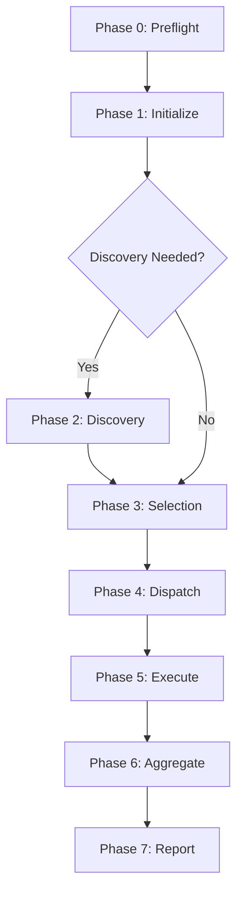
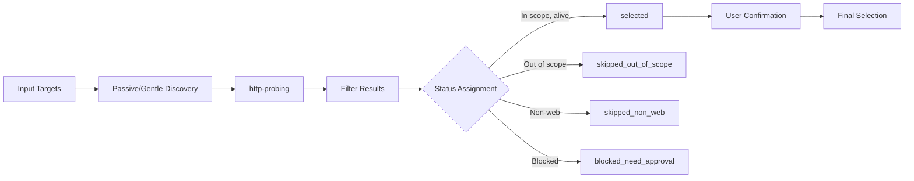

# Batch Task Template

> **Purpose**: Multi-target penetration testing workflow with unified authorization boundary and isolated task execution.

---

## Batch Task Structure

```text
RESULTS_ROOT/
└── BATCH-{YYYYMMDD}-{SEQ}-{batch_slug}/
    ├── batch.md                 # Batch entry point
    ├── targets.json             # Target registry and status
    ├── index.md                 # Task index (optional)
    ├── summary.json             # Batch-level summary
    ├── report.md                # Batch-level report
    └── targets/
        ├── T-001-{target_slug}/
        ├── T-002-{target_slug}/
        └── T-003-{target_slug}/
```

Each target subdirectory follows the single-task structure:

```text
targets/T-001-{target_slug}/
├── task.md
├── findings.md
├── summary.json
├── findings.json
├── evidence-index.json
├── report.md
├── 01-fingerprint.md
├── 02-discovery.md
├── 03-vuln-test.md
├── 04-chain.md
├── raw/
├── sessions/
└── screenshots/
```

---

## Batch Flow Overview



---

## Phase 0: Preflight

**Purpose**: Confirm batch authorization boundary before any probing.

### Required Confirmations

| Field | Description | Example |
|-------|-------------|---------|
| `targets` | Target list or IP ranges | `["example.com", "api.example.com", "192.168.1.0/24"]` |
| `scope` | Allowed domains/IPs/paths/accounts | `["example.com/*", "*.example.com"]` |
| `excluded` | Excluded targets or paths | `["staging.example.com", "/admin"]` |
| `intensity` | Testing intensity level | `passive`, `gentle`, `standard` |
| `allowed_capabilities` | Permitted capability types | `["http-probing", "fingerprinting", "url-extraction"]` |
| `blocked_capabilities` | Prohibited capability types | `["oob", "cloud-metadata", "internal-probing"]` |
| `credentials_scope` | Credential usage rules | `{allowed: false}` or `{allowed: true, targets: ["T-001"]}` |
| `batch_mode` | Task organization mode | `one-task-per-target`, `single-batch-task`, `discovery-first` |

### Batch Mode Selection

| Mode | When to Use | Characteristics |
|------|-------------|-----------------|
| `one-task-per-target` | Independent targets, multiple systems | Isolated scope, no session sharing, per-target task directory |
| `single-batch-task` | Same application, multiple entry points | Shared control, sliced context, unified findings |
| `discovery-first` | Domain/IP range with many candidates | Filter before deep testing |

### single-batch-task Mode Definition

Use `single-batch-task` **only when**:
- Multiple targets belong to the same application or business system
- Targets share authorization, business logic, or session context
- Findings may span multiple targets (e.g., cross-endpoint IDOR)

**Do NOT use** when:
- Targets are unrelated systems
- Targets require different authorization
- Targets require different credentials
- Target count is large (>10)
- Findings and evidence need strict per-target isolation

#### Directory Structure

```text
BATCH-{YYYYMMDD}-{SEQ}-{batch_slug}/
├── batch.md                 # Control context (always loaded)
├── targets.json             # Target index (always loaded)
├── summary.json             # Aggregated findings summary
├── report.md                # Final batch report
└── shared-task/
    ├── task.md              # Current work state (control context)
    ├── findings.md          # Unified findings (human-readable)
    ├── findings.json        # Unified findings (structured)
    ├── evidence-index.json  # Evidence index (loaded as needed)
    ├── slices/
    │   ├── T-001.md         # Target slice 1 (loaded one at a time)
    │   ├── T-002.md         # Target slice 2
    │   └── T-003.md         # Target slice 3
    ├── raw/                 # Raw evidence (not loaded by default)
    ├── sessions/            # Session records
    └── screenshots/         # Screenshots
```

#### Context Budget Rules

**Critical**: Never load all target details into context.

| Rule | Description |
|------|-------------|
| Control context | Always load: `batch.md`, `targets.json`, `shared-task/task.md` |
| Active slice | Load only ONE target slice: `shared-task/slices/T-{current}.md` |
| Payload file | Load only ONE relevant payload file for current test category |
| Evidence access | Use `evidence-index.json` as index; load raw evidence only when needed |
| Findings update | Summarize completed work into `findings.md`, `findings.json` |

#### Execution Unit

Each work unit is defined by:

```text
(target_id, entrypoint, phase, test_category)
```

Example execution unit:
```yaml
target_id: T-002
entrypoint: /api/v1/orders
phase: vulnerability_validation
test_category: idor
```

Execution flow:
1. Load control context (batch.md, targets.json, task.md)
2. Load active target slice (T-002.md)
3. Load relevant payload file (payloads/idor.md)
4. Execute test on entrypoint
5. Record finding with target attribution
6. Update findings.md, findings.json
7. Update evidence-index.json
8. Switch to next slice or continue

#### Evidence Attribution

Every finding and evidence item MUST include:

| Field | Description | Example |
|-------|-------------|---------|
| `target_id` | Which target produced this | `T-002` |
| `target` | Target URL/domain | `https://api.example.com` |
| `entrypoint` | Specific endpoint tested | `/api/v1/orders/:id` |
| `phase` | Testing phase | `phase_3` |
| `test_category` | Vulnerability class | `idor` |
| `evidence_id` | Unique evidence ID | `E-001` |
| `source_file` | Evidence source | `raw/http-responses.txt:120-135` |

#### Session Scope

| Rule | Description |
|------|-------------|
| Default | No session sharing between targets |
| Shared session | Allowed only when `credentials_scope.shared_session=true` |
| Session record | Must include: `session_id`, `allowed_targets`, `account_role`, `restrictions` |

Shared session example:
```json
{
  "session_id": "sess-admin-001",
  "session_type": "admin",
  "allowed_targets": ["T-001", "T-002", "T-003"],
  "account_role": "system_admin",
  "restrictions": ["no_production_data_modification"]
}
```

#### Stop Condition Scope

| Condition Type | Action |
|----------------|--------|
| Target-specific | Pause only that target in `targets.json`, continue others |
| Batch-wide | Pause entire batch when condition affects: |
| | - Shared credentials |
| | - Shared session state |
| | - Service stability (shared backend) |
| | - Authorization boundary |
| | - Critical finding with cross-target impact |

#### Slice Content Structure

Each `slices/T-XXX.md` contains:

```markdown
# Target Slice: T-002

## Target Info
- target_id: T-002
- target: https://api.example.com
- entrypoint: /api/v1/orders
- scope: /api/v1/*

## Current State
- phase: phase_3
- status: in_progress
- test_queue: [idor, auth-bypass, rate-limit]

## Findings (This Target)
- F-003: IDOR in order API [High]
- F-004: Missing rate limiting [Medium]

## Evidence References
- E-001: Order API response (raw/http-responses.txt:120-135)
- E-002: Rate limit test (screenshots/rate-limit-002.png)

## Next Actions
1. Complete IDOR validation
2. Test auth-bypass on /api/v1/admin
```

#### Key Principle

**single-batch-task = single control task, sliced target context**

Not: one giant task with all targets loaded in context.

This mode optimizes for:
- Shared authorization and scope
- Cross-target finding correlation
- Unified evidence chain
- Controlled context budget

```markdown
## Preflight Confirmation

- Authorization: User confirmed ownership or testing permission
- Targets: [list provided]
- Scope: [boundaries defined]
- Excluded: [explicit exclusions]
- Intensity: [level selected]
- Allowed Capabilities: [list]
- Blocked Capabilities: [list]
- Credentials: [allowed or not, scope if allowed]
- Batch Mode: [mode selected]
- User Signature: [timestamp or explicit confirmation]
```

---

## Phase 1: Initialize

**Purpose**: Create batch directory and initialize control files.

### Steps

1. Create `BATCH-{YYYYMMDD}-{SEQ}-{batch_slug}/` directory
2. Create `targets/` subdirectory
3. Initialize `batch.md` with preflight confirmations
4. Initialize `targets.json` with target registry
5. Create empty `summary.json`, `report.md`

### batch.md Template

```markdown
# Batch Meta

- batch_id: BATCH-{YYYYMMDD}-{SEQ}-{batch_slug}
- created_at: 2026-05-03T10:00:00Z
- updated_at: 2026-05-03T10:00:00Z
- status: initialized
- current_phase: phase_1

## Authorization

- confirmed_by: user
- confirmed_at: 2026-05-03T10:00:00Z
- scope: [scope details]
- excluded: [exclusion details]
- intensity: gentle
- allowed_capabilities: [list]
- blocked_capabilities: [list]
- credentials_scope: {allowed: false}

## Batch Mode

- mode: one-task-per-target
- total_targets: 3
- selected_targets: 0
- completed_targets: 0
- pending_targets: 3

## Stop Conditions

- triggered: []
- notes: none

## Next Actions

1. Process targets.json entries
2. Create target subdirectories
3. Begin Phase 2 (Discovery) if needed
```

---

## Phase 2: Discovery

**Purpose**: Filter candidates when input is domain list or IP range.

### When Discovery Needed

- Domain list without explicit targets
- IP range (e.g., `192.168.1.0/24`)
- Large subdomain enumeration result
- User requests candidate filtering

### Discovery Process



### Discovery Rules

| Rule | Description |
|------|-------------|
| Passive only | Use passive sources, no active probing |
| Gentle intensity | Rate-limited, minimal impact |
| In-scope filter | Remove excluded targets |
| Alive filter | Remove non-responsive targets |
| Web filter | Remove non-HTTP services (unless explicitly included) |

### Status Assignment

| Status | Condition | Action |
|--------|-----------|--------|
| `candidate` | Alive and potentially in-scope | Await selection decision |
| `selected` | User confirmed for testing | Create task directory |
| `skipped_out_of_scope` | Matches exclusion rule | Record reason, skip |
| `skipped_non_web` | No HTTP service detected | Record reason, skip |
| `blocked_need_approval` | Requires additional authorization | Pause, request approval |

---

## Phase 3: Selection

**Purpose**: User confirms targets for deep testing.

### Selection Output

Update `targets.json` with final status:

```json
{
  "targets": [
    {
      "target_id": "T-001",
      "target": "https://api.example.com",
      "status": "selected",
      "selection_reason": "primary API endpoint"
    },
    {
      "target_id": "T-002",
      "target": "https://staging.example.com",
      "status": "skipped_out_of_scope",
      "selection_reason": "matches exclusion rule: staging.*"
    }
  ]
}
```

### Selection Report

Create `index.md` with selection summary:

```markdown
# Target Selection Summary

## Selection Criteria

- Scope: example.com and subpaths, exclude staging.*
- Alive threshold: HTTP 200-299 or redirect
- Web-only: Yes

## Results

| Target | Status | Reason |
|--------|--------|--------|
| api.example.com | selected | Primary API |
| www.example.com | selected | Main website |
| staging.example.com | skipped_out_of_scope | Exclusion rule |
| 192.168.1.1:22 | skipped_non_web | SSH service |

## Statistics

- Candidates: 10
- Selected: 3
- Skipped (out of scope): 2
- Skipped (non-web): 5
```

---

## Phase 4: Dispatch

**Purpose**: Create task directories for selected targets.

### Dispatch Rules

| Rule | Description |
|------|-------------|
| One directory per target | `targets/T-{SEQ}-{target_slug}/` |
| Copy scope from batch | Sub-task cannot expand scope |
| Copy intensity from batch | Sub-task inherits intensity level |
| No credential sharing | Each task has isolated session scope |
| Blocked capabilities inherited | Sub-task cannot override |

### Dispatch Process

```bash
For each selected target:
1. Create T-{SEQ}-{target_slug}/ directory structure
2. Initialize task.md with inherited scope
3. Initialize empty findings.md, summary.json, findings.json, evidence-index.json
4. Create raw/, sessions/, screenshots/ directories
5. Update targets.json status to "initialized"
```

### Sub-task task.md Template

```markdown
# Task Meta

- task_id: T-001
- batch_id: BATCH-{YYYYMMDD}-{SEQ}-{batch_slug}
- target: https://api.example.com
- target_type: url
- status: initialized
- current_phase: phase_0

## Inherited Scope (from Batch)

- scope: https://api.example.com/*
- excluded: [from batch]
- intensity: gentle
- allowed_capabilities: [from batch]
- blocked_capabilities: [from batch]

## Session Scope

- credentials_allowed: false
- session_isolation: strict (no sharing with other targets)

## Stop Condition Binding

- Report to batch on: [stop conditions list]

## Next Actions

1. Begin Phase 0 (Fingerprint)
```

---

## Phase 5: Execute

**Purpose**: Run standard single-target flow for each task.

### Execution Rules

Each sub-task follows the standard 5-phase flow:

| Phase | Content |
|-------|---------|
| Phase 0 | Boundary confirmation, fingerprint |
| Phase 1 | Attack-surface mapping |
| Phase 2 | Targeted discovery |
| Phase 3 | Vulnerability validation |
| Phase 4 | Chain analysis, target-level report |

### Sub-task Constraints

| Constraint | Description |
|------------|-------------|
| No scope expansion | Cannot test outside inherited scope |
| No session sharing | Cannot use credentials from other targets |
| Blocked capabilities | Cannot execute blocked_capability types |
| Stop condition trigger | Must pause and report on trigger |
| Isolated evidence | Cannot reference evidence from other targets |

### Execution Monitoring

Main agent monitors `targets.json` for:

```json
{
  "targets": [
    {
      "target_id": "T-001",
      "status": "in_progress",
      "current_phase": "phase_2",
      "finding_counts": {"high": 1, "medium": 2},
      "stop_triggered": null
    },
    {
      "target_id": "T-002",
      "status": "paused",
      "stop_triggered": "service_instability",
      "stop_details": "Target returning 503 errors"
    }
  ]
}
```

---

## Phase 6: Aggregate

**Purpose**: Collect results from all completed tasks.

### Aggregation Process


### Aggregate Sources

| Source | Content |
|--------|---------|
| `targets/*/summary.json` | Target-level summary |
| `targets/*/findings.json` | Target-level findings |
| `targets/*/task.md` | Target status and scope |
| `targets/*/report.md` | Target-level report (optional) |

### Batch summary.json

```json
{
  "batch_id": "BATCH-{YYYYMMDD}-{SEQ}-{batch_slug}",
  "authorization": "confirmed_by_user",
  "scope": ["example.com/*"],
  "intensity": "gentle",
  "started_at": "2026-05-03T10:00:00Z",
  "ended_at": "2026-05-03T14:00:00Z",
  "target_counts": {
    "total": 3,
    "completed": 2,
    "paused": 1,
    "skipped": 0
  },
  "finding_counts": {
    "critical": 0,
    "high": 3,
    "medium": 5,
    "low": 2,
    "info": 10
  },
  "findings_by_target": {
    "T-001": {"high": 1, "medium": 2},
    "T-002": {"high": 2, "medium": 3}
  },
  "stop_triggered": [
    {"target_id": "T-003", "condition": "service_instability", "details": "503 errors"}
  ],
  "recommendations": [
    "Fix IDOR vulnerability in T-001",
    "Review authentication logic in T-002"
  ]
}
```

---

## Phase 7: Report

**Purpose**: Generate batch-level report for delivery.

### Batch Report Structure

```markdown
# Authorized AppSec Report

**Batch ID**: BATCH-{YYYYMMDD}-{SEQ}-{batch_slug}
**Date**: 2026-05-03
**Intensity**: Gentle
**Authorization**: Confirmed

---

## 1. Authorization and Scope

[Scope definition, exclusions, intensity, authorized by]

---

## 2. Target Coverage

| Target | Status | Findings | Notes |
|--------|--------|----------|-------|
| api.example.com | completed | High:1, Med:2 | Primary API |
| www.example.com | completed | High:2, Med:3 | Main website |
| admin.example.com | paused | High:0, Med:0 | Service instability |

---

## 3. Findings Summary

### By Severity

| Severity | Count | Top Finding |
|----------|-------|-------------|
| Critical | 0 | - |
| High | 3 | IDOR in user API |
| Medium | 5 | Missing rate limiting |
| Low | 2 | Version disclosure |
| Info | 10 | Endpoint enumeration |

### By Target

[Findings grouped by target with severity]

---

## 4. Critical/High Findings Detail

[Detailed findings with evidence references]

---

## 5. Skipped/Blocked Targets

| Target | Status | Reason |
|--------|--------|--------|
| staging.example.com | skipped_out_of_scope | Exclusion rule |
| 192.168.1.1:22 | skipped_non_web | SSH service |

---

## 6. Stop Conditions Triggered

| Target | Condition | Details | Action Taken |
|--------|-----------|---------|--------------|
| admin.example.com | service_instability | 503 errors | Paused, user notified |

---

## 7. Evidence Index

[Evidence references organized by target]

---

## 8. Remediation Recommendations

[Prioritized by severity and impact]

---

## 9. Appendix

- Targets tested
- Methods used
- Tools discovered
- Scope boundaries
```

---

## Resume Protocol

### Batch Resume

```markdown
Resume batch in this order:
1. Read batch.md (batch entry point)
2. Read targets.json (target registry and status)
3. For paused/in-progress targets:
   - Read targets/{target_id}/task.md
   - Read targets/{target_id}/findings.md
4. For specific target deep analysis:
   - Read targets/{target_id}/phase files
   - Read targets/{target_id}/evidence files (only if needed)
```

### Single Target Resume

When user specifies a single target within batch:

```markdown
Resume single target:
1. Read batch.md (confirm batch context)
2. Read targets.json (locate target entry)
3. Read targets/{target_id}/task.md
4. Read targets/{target_id}/findings.md
5. Read targets/{target_id}/current phase file
```

---

## Output Root Selection

Choose batch output root in this order:

1. User-specified directory
2. Existing batch directory when resuming
3. `$PENTEST_RESULTS_ROOT`, when set
4. `~/authorized-appsec/results/`

Use these names:

```text
SKILL_ROOT = directory containing SKILL.md; read-only bundled resources
RESULTS_ROOT = selected output root
BATCH_DIR = {RESULTS_ROOT}/BATCH-{YYYYMMDD}-{SEQ}-{batch_slug}
```

---

## Related Templates

| Template | Purpose |
|----------|---------|
| `templates/targets-schema.md` | targets.json structure definition |
| `templates/stop-conditions.md` | Unified stop condition definitions |
| `templates/task-template.md` | Single task structure (for sub-tasks) |
| `templates/findings-template.md` | Finding format (for sub-tasks) |
| `memory-protocol.md` | Single-task protocol |
