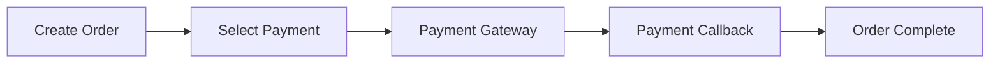

# E-Commerce Business Scenario Test Template

> **Scenario**: Online shopping platform penetration testing workflow
> **Target**: Order creation → Payment → Delivery workflow

---

## Core Business Flows

### Flow 1: User Registration & Authentication


**Test Points**:
- Registration logic flaws (role injection, mass assignment)
- Email verification bypass
- Password policy enforcement
- Session management after login

### Flow 2: Product Browse & Cart


**Test Points**:
- Product price exposure (API vs frontend)
- Cart manipulation (quantity tampering)
- Coupon abuse (reuse, limit bypass)
- Cart persistence (session vs user binding)

### Flow 3: Order & Payment



**Test Points**:
- Order ID predictability
- Payment method manipulation
- Payment callback replay
- Order status tampering
- Payment step skipping

---

## Key Test Cases

### 1. Price Tampering

| Test | Method | Expected | Vulnerable |
|------|--------|----------|------------|
| Price in request body | Modify `price` field to 0 | Backend validates price | Order created with price 0 |
| Price from API | Compare frontend vs API price | Consistent prices | API shows different price |
| Discount manipulation | Modify `discount` field | Backend validates | Arbitrary discount accepted |

**Payload**:
```json
POST /api/cart/add
{"product_id": 101, "quantity": 1, "price": 0.01}
```

### 2. Quantity Tampering

| Test | Method | Expected | Vulnerable |
|------|--------|----------|------------|
| Negative quantity | Set `quantity: -1` | Backend rejects | Total price decreases |
| Zero quantity | Set `quantity: 0` | Backend rejects | Free items |
| Large quantity | Set `quantity: 999999` | Backend caps | Integer overflow |

### 3. Coupon Abuse

| Test | Method | Expected | Vulnerable |
|------|--------|----------|------------|
| Coupon reuse | Apply same coupon twice | Rejected | Multiple discounts |
| Expired coupon | Use expired coupon code | Rejected | Coupon accepted |
| Limit bypass | Exceed usage limit | Rejected | No limit enforced |

**Race Condition Test**:
```bash
# Concurrent coupon application
curl -X POST "https://api.example.com/v1/coupons/apply" \
     -H "Authorization: Bearer <token>" \
     -d '{"code":"WELCOME50"}' & \
curl -X POST "https://api.example.com/v1/coupons/apply" \
     -H "Authorization: Bearer <token>" \
     -d '{"code":"WELCOME50"}' & \
wait
```

### 4. Order Manipulation

| Test | Method | Expected | Vulnerable |
|------|--------|----------|------------|
| Order ID prediction | Access other order IDs | 403 Forbidden | Other user's order visible |
| Order status change | PUT order status to PAID | Backend rejects | Status changed |
| Order cancellation timing | Cancel after payment | Refund processed | No refund or double refund |

### 5. Payment Flow

| Test | Method | Expected | Vulnerable |
|------|--------|----------|------------|
| Callback replay | Replay payment success callback | Rejected | Balance credited multiple times |
| Payment skip | Call order complete directly | Backend validates payment step | Order completed without payment |
| Payment amount mismatch | Modify amount in callback | Backend validates | Different amount credited |

---

## IDOR Test Matrix

| Endpoint | HTTP Method | Object Type | IDOR Risk |
|----------|-------------|-------------|-----------|
| `/api/users/{id}` | GET | User profile | Horizontal IDOR |
| `/api/orders/{id}` | GET | Order detail | Horizontal IDOR |
| `/api/orders/{id}` | PUT | Order update | Modify other's order |
| `/api/orders/{id}` | DELETE | Order cancel | Cancel other's order |
| `/api/cart/{user_id}` | GET | Cart | User ID in parameter |
| `/api/reviews/{id}` | POST | Review | Review for other's order |

---

## Output Format

```markdown
## Business Logic Finding: Price Tampering

### Scenario
E-commerce checkout flow

### Location
POST /api/cart/add

### Vulnerability
Price field accepted in request body without backend validation

### Proof
Request: {"product_id": 101, "quantity": 1, "price": 0.01}
Response: {"order_id": "8899", "total": 0.01}

### Severity
High - Direct financial impact possible

### Recommendation
Backend must validate price against product database, reject client-provided price values
```

---

## Execution Boundary

| Action | Default | Requires Authorization |
|--------|---------|------------------------|
| View own cart/order | ✓ Safe | - |
| View other's order (IDOR test) | ✓ Single test | Mass enumeration |
| Price tampering (proof) | ✓ Submit with modified price | Complete fraudulent purchase |
| Coupon race condition | ✓ Send 2 concurrent requests | Sustained abuse |
| Payment callback replay | ✓ Send callback once | Multiple replays |

**Safe Validation**: Prove vulnerability exists, do not complete actual fraudulent transactions.

---

## Related Payloads

- `payloads/api-business-logic.md` — General business logic payload reference
- `payloads/idor.md` — IDOR testing methodology
- `payloads/api-data-exposure.md` — Data exposure in responses
- `templates/severity-classification.md` — Business logic severity criteria