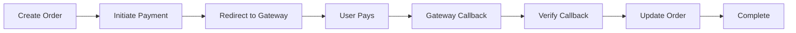

# Payment Integration Test Template

> **Scenario**: Payment gateway integration and callback handling
> **Target**: Payment initiation → Gateway redirect → Callback processing

---

## Payment Flow Overview

### Standard Payment Flow



### Callback Types

| Callback Type | Trigger | Risk |
|---------------|---------|------|
| Success callback | Payment successful | Credit balance, complete order |
| Failure callback | Payment failed | Cancel order, notify user |
| Refund callback | Refund processed | Deduct balance, update status |
| Pending callback | Payment pending | Hold order status |

---

## Key Vulnerability Categories

### 1. Callback Replay Attack

**Mechanism**: Payment gateway sends callback after successful payment. If callback can be replayed, balance credited multiple times.

**Tier 1: Safe Validation**

```bash
# Capture successful callback request (from logs or test payment)
POST /api/callbacks/payment
Content-Type: application/json
Signature: <gateway_signature>

{
  "order_id": "8899",
  "transaction_id": "txn_12345",
  "status": "success",
  "amount": 100.00,
  "timestamp": "2026-05-03T10:00:00Z"
}

# Replay same callback
curl -X POST "https://api.example.com/v1/callbacks/payment" \
     -H "Content-Type: application/json" \
     -d '{"order_id":"8899", "transaction_id":"txn_12345", "status":"success", "amount":100.00}'
```

**Vulnerable Indicators**:
- Same transaction_id accepted twice
- Balance credited multiple times
- No nonce/timestamp validation

**Protected Mechanisms**:
- Transaction_id uniqueness check
- Callback signature verification
- Timestamp window validation
- One-time callback token

### 2. Callback Parameter Tampering

**Tier 1: Safe Validation**

```bash
# Modify callback parameters
curl -X POST "https://api.example.com/v1/callbacks/payment" \
     -H "Content-Type: application/json" \
     -d '{"order_id":"8899", "status":"success", "amount":999.00}'

# Try different amounts, statuses
# Vulnerable: Backend accepts modified parameters
# Protected: Backend validates against original order
```

### 3. Callback Signature Bypass

**Tier 1: Safe Validation**

```bash
# Test if signature is validated
curl -X POST "https://api.example.com/v1/callbacks/payment" \
     -H "Content-Type: application/json" \
     -H "X-Payment-Signature: invalid_signature" \
     -d '{"order_id":"8899", "status":"success"}'

# Vulnerable: Callback accepted with invalid signature
# Protected: Signature verified, callback rejected

# Test missing signature
curl -X POST "https://api.example.com/v1/callbacks/payment" \
     -H "Content-Type: application/json" \
     -d '{"order_id":"8899", "status":"success"}'
```

### 4. Payment Step Skipping

**Tier 1: Safe Validation**

```bash
# Normal flow: create_order → initiate_payment → callback → complete
# Try calling complete directly

# Step 1: Create order
curl -X POST "https://api.example.com/v1/orders" \
     -d '{"product_id":101, "quantity":1}'
# Response: {"order_id": "8899", "status": "pending_payment"}

# Step 2: Try completing without payment
curl -X POST "https://api.example.com/v1/orders/8899/complete" \
     -H "Authorization: Bearer <token>"

# Vulnerable: Order completed without payment
# Protected: Backend checks payment status before completion
```

### 5. Order-Payment Mismatch

```bash
# Create order for $10
curl -X POST "https://api.example.com/v1/orders" \
     -d '{"product_id":101, "quantity":1}'

# Initiate payment for different amount
curl -X POST "https://api.example.com/v1/payments/initiate" \
     -d '{"order_id":"8899", "amount":1.00}'

# Vulnerable: Payment accepted for mismatched amount
# Protected: Backend validates payment amount == order amount
```

---

## Payment Gateway Integration Patterns

### Redirect-Based Payment (Most Common)

```text
1. Backend creates payment request with gateway
2. Backend stores payment_id with order
3. User redirected to gateway URL
4. User completes payment on gateway
5. Gateway redirects user back to frontend
6. Gateway sends backend callback (webhook)
7. Backend verifies callback, updates order
```

**Test Points**:
- Callback URL predictability
- Redirect URL manipulation
- Payment_id uniqueness

### Direct API Payment

```text
1. Frontend sends card data to backend
2. Backend calls gateway API
3. Gateway returns payment result
4. Backend updates order directly
```

**Test Points**:
- Card data handling (PCI compliance)
- API response validation
- Error handling

---

## Callback Security Checklist

| Security Mechanism | Test Method | Vulnerable Condition |
|--------------------|-------------|---------------------|
| Signature verification | Invalid/missing signature | Callback accepted |
| Transaction uniqueness | Replay same callback | Accepted twice |
| Amount validation | Modified amount in callback | Modified amount credited |
| Order binding | Callback for different order | Other order credited |
| Timestamp window | Old callback timestamp | Old callback accepted |
| IP whitelist | Callback from arbitrary IP | Non-gateway IP accepted |

---

## Severity Classification

| Payment Vulnerability | Severity | Reason |
|----------------------|----------|--------|
| Callback replay (no protection) | Critical | Direct financial loss |
| Signature bypass | Critical | Arbitrary callbacks accepted |
| Step skipping | High | Payment bypass |
| Amount tampering | High | Financial manipulation |
| Order-payment mismatch | High | Payment manipulation |

---

## Output Format

```markdown
## Business Logic Finding: Payment Callback Replay

### Scenario
Payment gateway callback processing

### Location
POST /api/callbacks/payment

### Vulnerability
Callback can be replayed, no transaction_id uniqueness check

### Proof
1. Captured callback: {"transaction_id": "txn_12345", ...}
2. Replayed callback: Same request sent again
3. Result: Balance credited twice

### Severity
Critical - Direct financial exploitation possible

### Recommendation
1. Verify callback signature using gateway public key
2. Store processed transaction_id, reject duplicates
3. Validate timestamp within acceptable window
4. Whitelist gateway IP addresses for callback endpoint
```

---

## Execution Boundary

| Action | Default | Requires Authorization |
|--------|---------|------------------------|
| Analyze callback structure | ✓ Safe | - |
| Replay single callback | ✓ Safe (test account) | - |
| Mass callback replay | ❌ | Requires authorization |
| Modify callback amount | ✓ Proof only | Execute fraudulent credit |
| Signature bypass test | ✓ Invalid signature test | - |

**Critical Boundary**: Payment vulnerabilities can cause direct financial loss. Always use test accounts and test payment amounts. Document proof without completing actual exploitation.

---

## Related Payloads

- `payloads/api-business-logic.md` — Race condition, replay attack payloads
- `templates/business-scenario-ecommerce.md` — E-commerce order flow
- `templates/severity-classification.md` — Business logic severity criteria