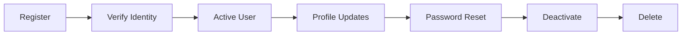

# User Lifecycle Test Template

> **Scenario**: User account lifecycle from registration to deletion
> **Target**: Registration → Authentication → Profile → Deactivation → Deletion

---

## User Lifecycle Overview

### Standard Lifecycle Flow



---

## Phase 1: Registration

### Registration Test Matrix

| Test Point | Method | Expected | Vulnerable |
|------------|--------|----------|------------|
| Role injection | Add `role: admin` to request | Backend ignores | User created as admin |
| Mass assignment | Add privileged fields | Fields rejected | Fields accepted |
| Email validation | Invalid email format | Validation error | Invalid email accepted |
| Duplicate registration | Same email twice | Rejected | New account created |
| Invitation bypass | Register without invitation | Rejected | Registration allowed |

**Tier 1: Safe Validation**

```bash
# Test role injection
curl -X POST "https://api.example.com/v1/users/register" \
     -H "Content-Type: application/json" \
     -d '{"username":"testuser", "email":"test@example.com", "password":"Password1!", "role":"admin"}'

# Test mass assignment
curl -X POST "https://api.example.com/v1/users/register" \
     -H "Content-Type: application/json" \
     -d '{"username":"testuser", "email":"test@example.com", "password":"Password1!", "isVerified":true, "credits":1000}'
```

---

## Phase 2: Email/Phone Verification

### Verification Bypass Test Matrix

| Test Point | Method | Expected | Vulnerable |
|------------|--------|----------|------------|
| OTP reuse | Use same OTP twice | Rejected | Accepted twice |
| OTP predictability | Sequential OTPs | Random OTPs | Predictable pattern |
| Verification response manipulation | Change client response | Backend validates | Client-side only |
| Verification skip parameter | Add `verified: true` | Backend ignores | Parameter accepted |
| Verification link reuse | Use link twice | Link expired | Link reusable |

**Tier 1: Safe Validation**

```bash
# Test verification skip via parameter
curl -X POST "https://api.example.com/v1/users/register" \
     -d '{"username":"testuser", "email":"test@example.com", "password":"Password1!", "email_verified":true}'

# Test OTP reuse (use test account)
curl -X POST "https://api.example.com/v1/verify/email" \
     -d '{"email":"test@example.com", "code":"123456"}'
# Wait, then reuse
curl -X POST "https://api.example.com/v1/verify/email" \
     -d '{"email":"test@example.com", "code":"123456"}'
```

---

## Phase 3: Authentication

### Login Test Matrix

| Test Point | Method | Expected | Vulnerable |
|------------|--------|----------|------------|
| Account enumeration | Different error for valid/invalid user | Same error | Enumeration possible |
| Rate limiting | Multiple failed attempts | Account locked | No lockout |
| Session fixation | Use specific session before login | New session created | Fixed session accepted |
| Remember me flaw | Extended session without refresh | Limited duration | Permanent session |

See `payloads/api-auth.md`, `payloads/mfa-bypass.md` for detailed authentication testing.

---

## Phase 4: Profile Management

### Profile Test Matrix

| Test Point | Method | Expected | Vulnerable |
|------------|--------|----------|------------|
| IDOR profile read | Access other user's profile | 403 Forbidden | Profile returned |
| IDOR profile update | Modify other user's profile | 403 Forbidden | Profile modified |
| Mass assignment | Add privileged fields | Fields rejected | Fields accepted |
| Email change bypass | Change email without verification | Verification required | Email changed directly |
| Password change flaw | Change without current password | Current password required | Password changed |

**Tier 1: Safe Validation**

```bash
# Test IDOR profile read
curl -X GET "https://api.example.com/v1/users/1002" \
     -H "Authorization: Bearer <user_A_token>"

# Test mass assignment in profile update
curl -X PUT "https://api.example.com/v1/users/me" \
     -H "Authorization: Bearer <token>" \
     -d '{"email":"new@example.com", "role":"admin"}'
```

---

## Phase 5: Password Reset

### Password Reset Test Matrix

| Test Point | Method | Expected | Vulnerable |
|------------|--------|----------|------------|
| Token predictability | Analyze reset token format | Random token | Predictable pattern |
| Token reuse | Use reset link twice | Token expired | Token reusable |
| Host header injection | Modify Host header | Link uses config host | Link uses injected host |
| Token leakage | Token in URL vs POST | Token in POST | Token visible in URL/logs |
| Account enumeration | Different reset response | Same response | User existence revealed |

See `payloads/password-reset.md` for detailed password reset testing.

---

## Phase 6: Account Deactivation/Suspension

### Deactivation Test Matrix

| Test Point | Method | Expected | Vulnerable |
|------------|--------|----------|------------|
| Deactivation IDOR | Deactivate other user's account | 403 Forbidden | Account deactivated |
| Deactivation bypass | Access after deactivation | Access denied | Access allowed |
| Self-deactivation flaw | Deactivate while active operations | Operations cancelled | Operations continue |
| Suspension bypass | Login during suspension | Login blocked | Login allowed |

---

## Phase 7: Account Deletion

### Deletion Test Matrix

| Test Point | Method | Expected | Vulnerable |
|------------|--------|----------|------------|
| Deletion IDOR | Delete other user's account | 403 Forbidden | Account deleted |
| Data persistence | Check data after deletion | Data removed | Data remains |
| Deletion revert | Restore deleted account | Cannot restore | Account restored |
| Deletion confirmation | Delete without confirmation | Confirmation required | Immediate deletion |

**Tier 1: Safe Validation (Test Account)**

```bash
# Test deletion IDOR
curl -X DELETE "https://api.example.com/v1/users/1002" \
     -H "Authorization: Bearer <user_A_token>"

# Test data persistence after self-deletion
curl -X DELETE "https://api.example.com/v1/users/me" \
     -H "Authorization: Bearer <token>"

# Try accessing data after deletion
curl -X GET "https://api.example.com/v1/users/me/data" \
     -H "Authorization: Bearer <old_token>"
```

---

## Cross-Phase Vulnerabilities

### Session Continuity Issues

| Phase Transition | Test | Vulnerable Condition |
|------------------|------|---------------------|
| Registration → Login | Pre-registration session used after login | Session fixation |
| Password Reset → Login | Reset session becomes login session | Session continuity flaw |
| Deactivation → Login | Session remains valid after deactivation | Session not invalidated |
| Deletion → Login | Token/session valid after deletion | Credentials not purged |

### Privilege Escalation Across Phases

| Phase | Escalation Path | Severity |
|-------|-----------------|----------|
| Registration | Role injection → admin account | Critical |
| Verification | Skip verification → verified privileges | High |
| Profile update | Mass assignment → elevated role | High |
| Password reset | Reset other user's password | Critical |

---

## Output Format

```markdown
## User Lifecycle Finding: Mass Assignment at Registration

### Scenario
User registration flow

### Location
POST /api/users/register

### Vulnerability
Backend accepts `role` and `isVerified` fields in registration request

### Proof
Request: {"username":"testuser", "password":"...", "role":"admin", "isVerified":true}
Response: {"id":1001, "username":"testuser", "role":"admin", "isVerified":true}

### Severity
Critical - Admin account created via registration

### Recommendation
1. Define explicit allowed fields for registration
2. Reject or ignore all non-whitelisted fields
3. Set role and verification status only via internal logic
```

---

## Execution Boundary

| Action | Default | Requires Authorization |
|--------|---------|------------------------|
| Register test account | ✓ Safe | - |
| Verify test account | ✓ Safe (test account OTP) | - |
| Test IDOR (single object) | ✓ Safe | Mass enumeration |
| Test mass assignment | ✓ Submit modified request | Execute privilege escalation |
| Delete test account | ✓ Safe (self-deletion) | Delete other's account |

**Safe Validation**: Use dedicated test accounts for lifecycle testing. Do not test on production accounts or enumerate real user data.

---

## Related Payloads

- `payloads/api-auth.md` — Authentication vulnerabilities
- `payloads/password-reset.md` — Password reset vulnerabilities
- `payloads/mfa-bypass.md` — MFA bypass techniques
- `payloads/idor.md` — IDOR across user endpoints
- `payloads/api-data-exposure.md` — Data exposure in user responses
- `templates/severity-classification.md` — Severity criteria