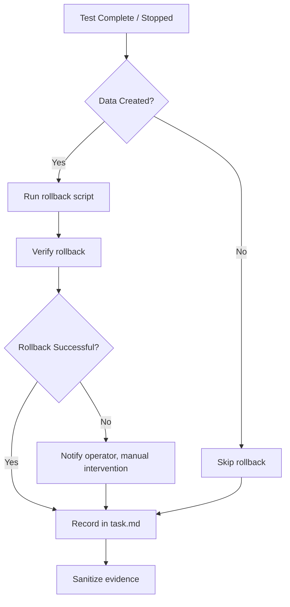

# Cleanup & Rollback Protocol

> **Purpose**: Systematic removal of test artifacts, data, and accounts created during authorized AppSec assessment.

---

## When to Use

| Scenario | Action |
|----------|--------|
| After all testing is complete | Full cleanup pass |
| After each Phase 3 validation | Per-finding cleanup |
| When task is stopped/terminated | Immediate cleanup |
| Before evidence delivery | Sanitize sensitive data |

---

## Cleanup Checklist

### Test Accounts & Session Material

- [ ] Delete all test user accounts created during testing
- [ ] Invalidate all test sessions and tokens
- [ ] Remove test cookies from evidence (redact values in `sessions/`)
- [ ] Verify no persistent login state remains

### Test Data

- [ ] Remove test records created via authorized write operations
- [ ] Delete test files uploaded during file-upload validation
- [ ] Remove test comments, posts, or database entries
- [ ] Verify API rate limit counters are not permanently affected

### Configuration Changes

- [ ] Revert any configuration changes made for testing
- [ ] Restore original settings if defaults were modified
- [ ] Re-enable any temporarily disabled security controls
- [ ] Remove test DNS records or subdomain entries if any were created

### Network Artifacts

- [ ] Close any persistent connections to target
- [ ] Remove firewall rules or ACL entries added for testing
- [ ] Delete any SSL/TLS certificates installed for MITM proxy
- [ ] Clear ARP/DNS caches on test machines

---

## Rollback Decision Tree



---

## Evidence Sanitization

Before delivering evidence, redact:

| Item | Action |
|------|--------|
| Session cookies/tokens | Replace values with `<REDACTED>` |
| Credentials in screenshots | Blur or pixelate |
| Internal IP addresses | Mask last octet (e.g., `<internal-ip-prefix>.XX`) |
| API keys in raw responses | Replace with `<REDACTED>` |
| Test account PII | Remove completely |
| Email addresses | Mask domain-local part |

---

## Task Completion Record

Update `task.md` with cleanup status:

```markdown
## Cleanup Status

- cleanup_completed: true
- cleanup_date: YYYY-MM-DD HH:MM
- test_accounts_deleted: 2
- test_records_removed: 5
- config_changes_reverted: 0
- rollback_required: false
- rollback_successful: N/A
- evidence_sanitized: true
```

---

## Response Protocol If Cleanup Fails

1. Document the failure in `task.md` immediately
2. Notify the target system operator
3. Provide exact details: what was created, when, by whom
4. Request assistance in manual removal
5. Record the incident in the final report

---

## Script Usage

```bash
# Run cleanup for a single task
bash scripts/cleanup.sh <task_dir>

# Run cleanup for batch (target by target)
bash scripts/cleanup.sh <batch_dir> --batch

# Preview cleanup actions without executing
bash scripts/cleanup.sh <task_dir> --dry-run
```
