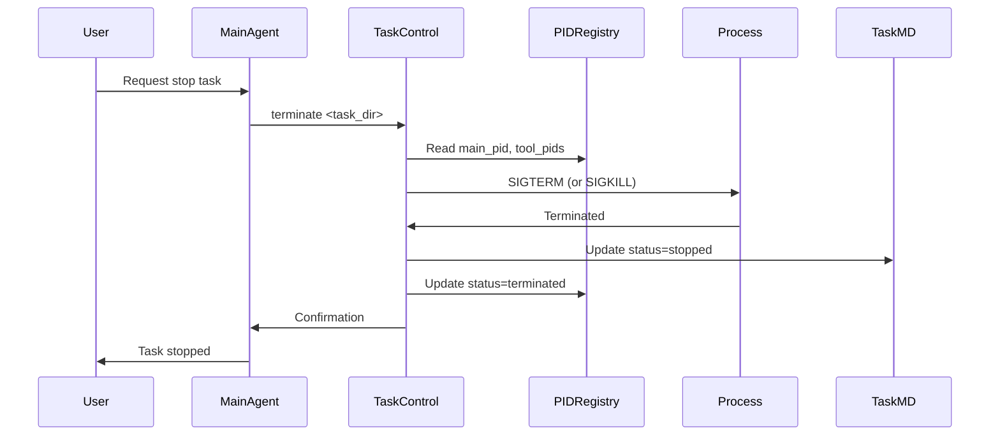
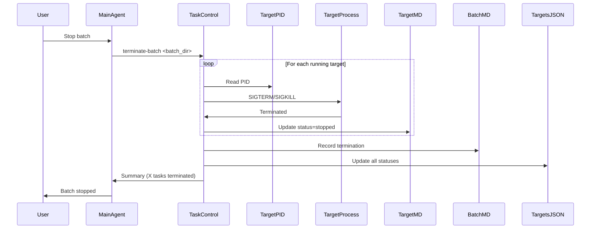
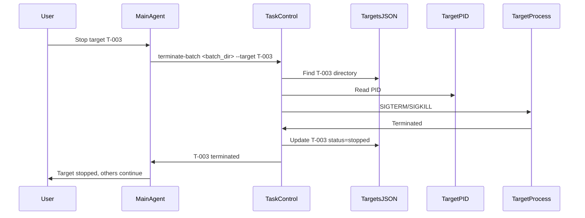

# Process Control Protocol

> **Purpose**: Force terminate sub-task execution during batch or single-task penetration testing.

---

## Problem Statement

Current skill design allows stop conditions to pause tasks, but lacks **force termination** capability:

| Gap | Impact |
|-----|--------|
| No process tracking | Cannot identify which processes to kill |
| No PID registry | Cannot map task to running processes |
| No kill mechanism | Cannot stop running tools (httpx, nuclei, etc.) |
| No cleanup protocol | Terminated tasks leave incomplete state |

---

## Process Control Architecture

### Components

| Component | File | Purpose |
|-----------|------|---------|
| PID Registry | `.task-pids.json` | Track process IDs per task |
| Control Script | `scripts/task-control.sh` | Monitor, terminate, list processes |
| Termination Protocol | This document | Define when/how to terminate |
| TaskStop Integration | Claude Tool | Stop agent execution |

### Directory Structure Update

```text
TASK_DIR/
├── task.md
├── findings.md
├── .task-pids.json    # NEW: Process registry
└── ...

BATCH_DIR/
├── batch.md
├── targets.json
├── .batch-control.json # NEW: Batch-level process control
└── targets/
    ├── T-001-*/
    │   └── .task-pids.json
    └── T-002-*/
        └── .task-pids.json
```

---

## PID Registry Schema

### .task-pids.json

```json
{
  "task_id": "T-001",
  "batch_id": "BATCH-{YYYYMMDD}-{SEQ}-{batch_slug}",
  "main_pid": 12345,
  "tool_pids": [
    {
      "pid": 12346,
      "name": "httpx",
      "command": "httpx -u https://example.com",
      "started": "2026-05-03T10:00:00Z"
    },
    {
      "pid": 12347,
      "name": "nuclei",
      "command": "nuclei -u https://example.com -tags cve",
      "started": "2026-05-03T10:01:00Z"
    }
  ],
  "start_time": "2026-05-03T10:00:00Z",
  "status": "running",
  "signals_received": []
}
```

### Status Values

| Status | Condition |
|--------|-----------|
| `not_started` | PID file initialized, no process running |
| `running` | Main process active, tool processes may be active |
| `paused` | Process suspended (not implemented yet) |
| `terminated` | Process killed by signal |
| `completed` | Process finished normally |
| `failed` | Process crashed or failed |

---

## Termination Signals

### Signal Types

| Signal | Code | Behavior | Use Case |
|--------|------|----------|----------|
| SIGTERM | 15 | Graceful termination | Default, allows cleanup |
| SIGKILL | 9 | Immediate termination | Force kill, no cleanup |
| SIGINT | 2 | Interrupt (Ctrl+C) | User keyboard interrupt |
| SIGHUP | 1 | Hangup | Terminal disconnect |

### Signal Selection

```text
Default flow:
1. SIGTERM (graceful) - Wait 2 seconds
2. If still alive → SIGKILL (force)

Force flag (--force):
1. SIGKILL immediately
```

---

## Termination Protocol

### When to Terminate

| Trigger | Source | Action |
|---------|--------|--------|
| User request | "stop testing", "terminate target X" | Immediate termination |
| Stop condition | Critical finding, service crash | Pause then terminate if needed |
| Timeout | Task exceeding time limit | Graceful termination |
| Error | Unrecoverable error in task | Graceful termination |
| Batch stop | User stops entire batch | Terminate all running targets |

### Termination Decision Matrix

| Condition | Graceful (SIGTERM) | Force (SIGKILL) |
|-----------|--------------------|-----------------|
| User requests stop | Default | If user specifies "force" |
| Critical finding confirmed | ✓ | If task unresponsive |
| Service instability | ✓ | No (let task detect) |
| Timeout exceeded | ✓ | If timeout > 5 min |
| Task frozen/unresponsive | Try first | ✓ After SIGTERM fails |

---

## Execution Flow

### Single Task Termination



### Batch Termination (All Targets)



### Specific Target Termination



---

## Tool Integration

### Starting Tools with PID Tracking

When main agent launches a tool:

```bash
# 1. Launch tool in background
httpx -u https://example.com -json -o results.json &
TOOL_PID=$!

# 2. Record PID (use --pid for pid, --name for tool name)
./scripts/task-control.sh add-tool-pid <task_dir> --pid $TOOL_PID --name httpx

# 3. Wait or continue
wait $TOOL_PID || true

# 4. Cleanup when done
./scripts/task-control.sh cleanup-tool-pid <task_dir> --pid $TOOL_PID
```

### Tool Wrapper Pattern

```bash
# Wrapper function for tracked tool execution
run_tracked_tool() {
  local task_dir="$1"
  local tool_name="$2"
  local tool_command="$3"

  # Execute in background
  eval "$tool_command &"
  local pid=$!

  # Register PID
  jq --arg pid "$pid" --arg name "$tool_name" \
     '.tool_pids += [{"pid": $pid, "name": $name}]' \
     "${task_dir}/.task-pids.json" > "${task_dir}/.task-pids.json.tmp" \
     && mv "${task_dir}/.task-pids.json.tmp" "${task_dir}/.task-pids.json"

  # Return PID for monitoring
  echo $pid
}
```

---

## TaskStop Tool Integration

### Claude Code TaskStop

Main agent can use TaskStop to stop background tasks:

```json
{
  "tool": "TaskStop",
  "shell_id": "background_httpx_scan",
  "reason": "User requested stop"
}
```

### Mapping TaskStop to task-control.sh

| TaskStop Action | task-control.sh Equivalent |
|-----------------|---------------------------|
| Stop background shell | `terminate <task_dir>` |
| Stop agent task | `terminate <task_dir> --force` |
| Stop specific background | `terminate-batch --target <id>` |

---

## User Commands

### Command Syntax

| User Request | Interpretation |
|--------------|----------------|
| "stop" | Terminate current task |
| "stop target T-003" | Terminate specific target in batch |
| "stop all" / "stop batch" | Terminate entire batch |
| "force stop" | SIGKILL instead of SIGTERM |
| "pause" | Not implemented (would require SIGSTOP/SIGCONT) |

### Command Detection

Main agent should interpret:

```text
User: "stop testing" → stop current task
User: "terminate T-002" → terminate target T-002 in batch
User: "stop all" → terminate all in batch
User: "force stop" → force kill (SIGKILL)
User: "kill target T-003" → force kill specific target
```

---

## Cleanup Protocol

### After Termination

| Step | Action | File |
|------|--------|------|
| 1 | Update task.md status | `task.md` |
| 2 | Update PID registry | `.task-pids.json` |
| 3 | Update targets.json (batch) | `targets.json` |
| 4 | Update batch.md (batch) | `batch.md` |
| 5 | Kill orphan processes | Check for remaining tool_pids |

### Cleanup Script

```bash
# After termination, clean up any remaining processes
./scripts/task-control.sh cleanup <task_dir>

# This checks for:
# - Processes still listed in tool_pids but actually dead
# - Orphan child processes
# - Temporary files that should be removed
```

---

## Monitoring

### Real-time Status Check

```bash
# Check task process status
./scripts/task-control.sh status <task_dir>

# Output:
# Main PID: 12345
# Status: running
# Started: 2026-05-03T10:00:00Z
# Tool Processes: 2
#   - httpx: PID 12346
#   - nuclei: PID 12347
# Alive: 2, Dead: 0
```

### Batch Process List

```bash
# List all processes in batch
./scripts/task-control.sh list-processes <batch_dir>

# Output:
# RUNNING T-001-api-example-com (PID: 12345)
# RUNNING T-002-www-example-com (PID: 12350)
# STOPPED T-003-admin-example-com
# Summary: Running=2, Stopped=1, NotTracked=0
```

---

## Integration Points

### In SKILL.md

Add to References table:

```markdown
| Process control | `scripts/task-control.sh` |
| Termination protocol | `templates/process-control.md` |
```

### In batch-template.md

Add termination section:

```markdown
## Termination

To stop batch execution:
1. User requests stop
2. Main agent calls task-control.sh terminate-batch
3. All running processes killed
4. targets.json updated with status=stopped
5. batch.md records termination
```

### In stop-conditions.md

Add forced termination option:

```markdown
When stop condition triggers:
1. Default: Pause and notify user
2. User choice: Continue, Stop gracefully, Force stop
3. Force stop: task-control.sh terminate --force
```

---

## Error Handling

### Termination Failures

| Error | Cause | Resolution |
|-------|-------|------------|
| PID not found | Process already dead | Update registry, continue |
| Permission denied | Not process owner | Run with correct user, or escalate |
| Process zombie | Parent not reaped | Kill parent, or wait |
| Orphan processes | Main killed but tools alive | Kill all tool_pids |

### Recovery

```bash
# If termination partially failed
# Find and kill all processes by task directory name
ps aux | grep "<task_dir_pattern>" | awk '{print $2}' | xargs kill -9

# Or kill all processes owned by current user running testing tools
pkill -u $USER -f "httpx|nuclei|ffuf|gobuster"
```

---

## Security Considerations

### Process Isolation

| Rule | Reason |
|------|--------|
| Only kill own processes | Security boundary |
| Track PID at launch | Avoid killing wrong process |
| Verify PID before kill | Prevent PID reuse attack |
| Log all termination actions | Audit trail |

### PID Verification

Before killing, verify PID belongs to expected process:

```bash
# Verify process command matches expectation
ps -p $PID -o command= | grep -q "httpx" && kill $PID
```

---

## Limitations

### Current Constraints

| Limitation | Impact | Mitigation |
|------------|--------|------------|
| No process pause | Cannot pause/resume | Terminate and restart |
| No checkpoint | Cannot resume mid-phase | Restart from last phase file |
| No distributed tracking | Single machine only | For VM execution, this is sufficient |
| Tool-specific cleanup | Some tools leave temp files | Manual cleanup or tool-specific handlers |

### Future Enhancements

| Enhancement | Benefit |
|-------------|---------|
| Process pause (SIGSTOP) | Resume without restart |
| Phase checkpointing | Resume mid-execution |
| Distributed PID tracking | Multi-VM batch testing |
| Tool cleanup hooks | Automatic temp file removal |

---

## Related Files

| File | Purpose |
|------|---------|
| `scripts/task-control.sh` | Process control commands |
| `templates/batch-template.md` | Batch workflow |
| `templates/stop-conditions.md` | Stop trigger definitions |
| `templates/targets-schema.md` | targets.json with stop_triggered |
| `SKILL.md` | Process control reference |
