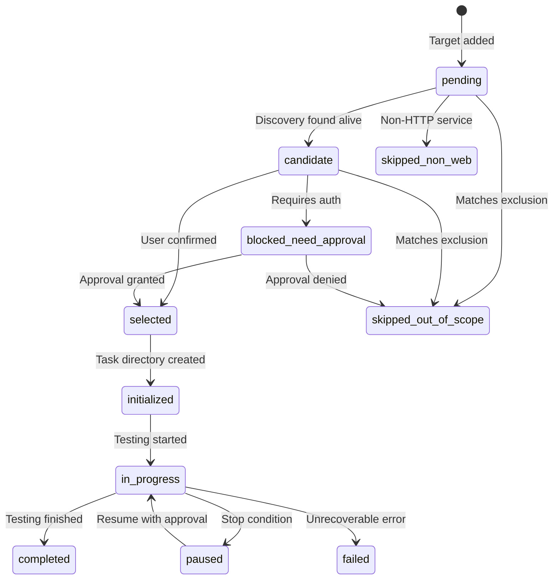

# targets.json Schema

> **Purpose**: Target registry and status control for batch authorized AppSec assessment.

---

## Schema Definition

```json
{
  "$schema": "https://json-schema.org/draft/2020-12/schema",
  "title": "Batch Targets Registry",
  "type": "object",
  "required": ["batch_id", "authorization", "intensity", "targets"],
  "properties": {
    "batch_id": {
      "type": "string",
      "pattern": "^BATCH-[0-9]{8}-[0-9]{3}",
      "description": "Unique batch identifier"
    },
    "authorization": {
      "type": "object",
      "required": ["confirmed", "confirmed_at", "confirmed_by"],
      "properties": {
        "confirmed": {
          "type": "boolean",
          "description": "Whether authorization was confirmed"
        },
        "confirmed_at": {
          "type": "string",
          "format": "date-time",
          "description": "Timestamp of authorization confirmation"
        },
        "confirmed_by": {
          "type": "string",
          "description": "Source of confirmation (user, document, etc.)"
        },
        "scope_document": {
          "type": "string",
          "description": "Reference to scope document if applicable"
        }
      }
    },
    "scope": {
      "type": "array",
      "items": {"type": "string"},
      "description": "Allowed scope boundaries"
    },
    "excluded": {
      "type": "array",
      "items": {"type": "string"},
      "description": "Explicit exclusions from scope"
    },
    "intensity": {
      "type": "string",
      "enum": ["passive", "gentle", "standard"],
      "description": "Testing intensity level"
    },
    "allowed_capabilities": {
      "type": "array",
      "items": {"type": "string"},
      "description": "Capability types permitted for this batch"
    },
    "blocked_capabilities": {
      "type": "array",
      "items": {"type": "string"},
      "description": "Capability types prohibited for this batch"
    },
    "credentials_scope": {
      "type": "object",
      "required": ["allowed"],
      "properties": {
        "allowed": {
          "type": "boolean",
          "description": "Whether credentials may be used"
        },
        "targets": {
          "type": "array",
          "items": {"type": "string"},
          "description": "Target IDs where credentials are allowed (if allowed)"
        },
        "session_types": {
          "type": "array",
          "items": {
            "type": "string",
            "enum": ["anonymous", "user", "admin", "service"]
          },
          "description": "Session types permitted"
        },
        "shared_session": {
          "type": "boolean",
          "default": false,
          "description": "Whether session can be shared across targets (single-batch-task only)"
        },
        "session_config": {
          "type": "object",
          "description": "Shared session configuration (if shared_session=true)",
          "properties": {
            "session_id": {"type": "string"},
            "allowed_targets": {
              "type": "array",
              "items": {"type": "string"}
            },
            "account_role": {"type": "string"},
            "restrictions": {
              "type": "array",
              "items": {"type": "string"}
            }
          }
        }
      }
    },
    "batch_mode": {
      "type": "string",
      "enum": ["one-task-per-target", "single-batch-task", "discovery-first"],
      "description": "Task organization mode"
    },
    "created_at": {
      "type": "string",
      "format": "date-time",
      "description": "Batch creation timestamp"
    },
    "updated_at": {
      "type": "string",
      "format": "date-time",
      "description": "Last update timestamp"
    },
    "targets": {
      "type": "array",
      "items": {
        "type": "object",
        "required": ["target_id", "target", "status"],
        "properties": {
          "target_id": {
            "type": "string",
            "pattern": "^T-[0-9]{3}",
            "description": "Unique target identifier within batch"
          },
          "target": {
            "type": "string",
            "description": "Target URL, domain, IP, or IP range"
          },
          "target_type": {
            "type": "string",
            "enum": ["url", "domain", "ip", "ip_range"],
            "description": "Target type classification"
          },
          "scope": {
            "type": "array",
            "items": {"type": "string"},
            "description": "Target-specific scope (inherits from batch if empty)"
          },
          "status": {
            "type": "string",
            "enum": [
              "pending",
              "candidate",
              "selected",
              "initialized",
              "in_progress",
              "paused",
              "stopped",
              "terminated",
              "completed",
              "failed",
              "skipped_out_of_scope",
              "skipped_non_web",
              "blocked_need_approval"
            ],
            "description": "Current target status"
          },
          "current_phase": {
            "type": ["string", "null"],
            "enum": ["phase_0", "phase_1", "phase_2", "phase_3", "phase_4", "phase_5", null],
            "description": "Current testing phase (null if not started). phase_0-5 for both single-task and batch targets"
          },
          "task_dir": {
            "type": "string",
            "description": "Relative path to target task directory"
          },
          "finding_counts": {
            "type": "object",
            "properties": {
              "critical": {"type": "integer", "minimum": 0},
              "high": {"type": "integer", "minimum": 0},
              "medium": {"type": "integer", "minimum": 0},
              "low": {"type": "integer", "minimum": 0},
              "info": {"type": "integer", "minimum": 0}
            },
            "description": "Finding counts by severity"
          },
          "stop_triggered": {
            "type": ["string", "null"],
            "enum": [
              "critical_finding",
              "credential_or_token_exposure",
              "mass_data_exposure",
              "service_crash_risk",
              "legal_concern_detected",
              "out_of_scope_target",
              "service_instability",
              "destructive_action_required",
              "lateral_movement_risk",
              "internal_probing_required",
              "scope_creep_detected",
              "rate_limit_triggered",
              "waf_block_detected",
              "oob_required",
              "cloud_metadata_required",
              "authenticated_testing_required",
              "persistence_risk",
              "tool_failure_critical",
              "network_unreachable",
              "dns_resolution_failed",
              null
            ],
            "description": "Stop condition triggered (null if none). Names match stop-conditions.md exactly. ssl_certificate_invalid is a warning only, not a stop condition."
          },
          "stop_details": {
            "type": "string",
            "description": "Details about stop condition if triggered"
          },
          "selection_reason": {
            "type": "string",
            "description": "Reason for selection or skip status"
          },
          "discovery_metadata": {
            "type": "object",
            "properties": {
              "status_code": {"type": "integer"},
              "title": {"type": "string"},
              "tech_stack": {"type": "array", "items": {"type": "string"}},
              "waf_detected": {"type": "boolean"},
              "redirect_target": {"type": "string"}
            },
            "description": "Metadata from discovery phase"
          },
          "started_at": {
            "type": "string",
            "format": "date-time",
            "description": "Target testing start timestamp"
          },
          "ended_at": {
            "type": "string",
            "format": "date-time",
            "description": "Target testing end timestamp"
          }
        }
      },
      "description": "List of targets in this batch"
    },
    "statistics": {
      "type": "object",
      "properties": {
        "total_targets": {"type": "integer", "minimum": 0},
        "selected_targets": {"type": "integer", "minimum": 0},
        "completed_targets": {"type": "integer", "minimum": 0},
        "paused_targets": {"type": "integer", "minimum": 0},
        "skipped_targets": {"type": "integer", "minimum": 0},
        "failed_targets": {"type": "integer", "minimum": 0},
        "total_findings": {
          "type": "object",
          "properties": {
            "critical": {"type": "integer", "minimum": 0},
            "high": {"type": "integer", "minimum": 0},
            "medium": {"type": "integer", "minimum": 0},
            "low": {"type": "integer", "minimum": 0},
            "info": {"type": "integer", "minimum": 0}
          }
        }
      },
      "description": "Batch-level statistics"
    },
    "stop_triggered": {
      "type": "array",
      "items": {
        "type": "object",
        "properties": {
          "target_id": {"type": "string"},
          "condition": {"type": "string"},
          "details": {"type": "string"},
          "action_taken": {"type": "string"}
        }
      },
      "description": "List of stop conditions triggered in batch"
    },
    "notes": {
      "type": "string",
      "description": "Additional notes about the batch"
    }
  }
}
```

---

## Status Lifecycle

### Status Flow



### Status Definitions

| Status | Condition | Allowed Actions |
|--------|-----------|-----------------|
| `pending` | Added to registry, awaiting discovery | Discovery probing |
| `candidate` | Alive, potentially in-scope | Selection decision |
| `selected` | User confirmed for testing | Directory creation |
| `initialized` | Task directory created | Begin testing |
| `in_progress` | Testing active | Phase execution |
| `paused` | Stop condition triggered | Wait for decision |
| `completed` | Testing finished | Aggregation, reporting |
| `failed` | Unrecoverable error | Log error, skip |
| `skipped_out_of_scope` | Matches exclusion rule | No testing |
| `skipped_non_web` | Non-HTTP service | No testing (unless explicitly included) |
| `blocked_need_approval` | Requires additional authorization | Wait for approval |

---

## Capability Lists

### Standard Capabilities

| Capability | Description | Default Status |
|------------|-------------|----------------|
| `http-probing` | HTTP service probing | Allowed |
| `fingerprinting` | Technology fingerprinting | Allowed |
| `url-extraction` | URL/endpoint extraction | Allowed |
| `directory-scanning` | Path enumeration | Allowed (gentle intensity) |
| `vulnerability-scanning` | Known vulnerability scanning | Allowed (gentle intensity) |

### Restricted Capabilities (Require Explicit Allow)

| Capability | Description | Default Status |
|------------|-------------|----------------|
| `oob` | Out-of-band exfiltration | Blocked |
| `cloud-metadata` | Cloud metadata access | Blocked |
| `internal-probing` | Internal network probing | Blocked |
| `authenticated-testing` | Using supplied credentials | Blocked unless allowed |
| `destructive-validation` | State-changing validation | Blocked |

---

## Minimal Example

```json
{
  "batch_id": "BATCH-{YYYYMMDD}-{SEQ}-{batch_slug}",
  "authorization": {
    "confirmed": true,
    "confirmed_at": "2026-05-03T10:00:00Z",
    "confirmed_by": "user"
  },
  "scope": ["example.com/*", "*.example.com"],
  "excluded": ["staging.example.com"],
  "intensity": "gentle",
  "allowed_capabilities": ["http-probing", "fingerprinting", "url-extraction"],
  "blocked_capabilities": ["oob", "cloud-metadata", "internal-probing"],
  "credentials_scope": {
    "allowed": false
  },
  "batch_mode": "one-task-per-target",
  "created_at": "2026-05-03T10:00:00Z",
  "updated_at": "2026-05-03T10:00:00Z",
  "targets": [
    {
      "target_id": "T-001",
      "target": "https://api.example.com",
      "target_type": "url",
      "status": "pending",
      "task_dir": "targets/T-001-api-example-com"
    },
    {
      "target_id": "T-002",
      "target": "https://www.example.com",
      "target_type": "url",
      "status": "pending",
      "task_dir": "targets/T-002-www-example-com"
    }
  ]
}
```

---

## Update Rules

### When to Update

| Event | Fields to Update |
|-------|------------------|
| Authorization confirmed | `authorization.*`, `updated_at` |
| Target discovery | `targets[].discovery_metadata`, `targets[].status` |
| Target selection | `targets[].status`, `targets[].selection_reason`, `statistics.selected_targets` |
| Task initialization | `targets[].status`, `targets[].task_dir` |
| Phase progress | `targets[].status`, `targets[].current_phase`, `targets[].finding_counts` |
| Stop triggered | `targets[].stop_triggered`, `targets[].stop_details`, `stop_triggered` |
| Task completion | `targets[].status`, `targets[].ended_at`, `statistics.completed_targets` |

### Update Process

```bash
# After each significant event:
1. Update relevant target entry
2. Recalculate statistics
3. Update updated_at timestamp
4. Sync to batch.md if status changed
```

---

## Validation Rules

### Authorization Validation

```json
// Must be confirmed before any active probing
{
  "authorization": {
    "confirmed": true  // Required: true
  }
}
```

### Scope Validation

```json
// Each target must be within scope
{
  "targets": [
    {
      "target": "https://api.example.com",
      // Must match one of batch.scope patterns
      // Must not match any batch.excluded patterns
    }
  ]
}
```

### Capability Validation

```json
// Blocked capabilities cannot be overridden at target level
{
  "blocked_capabilities": ["oob"],
  "targets": [
    {
      // Cannot allow oob at target level
      // Sub-task inherits blocked_capabilities
    }
  ]
}
```

---

## Evidence Attribution Requirements

In `single-batch-task` mode, every finding and evidence item must include attribution fields:

### Required Attribution Fields

| Field | Type | Description | Example |
|-------|------|-------------|---------|
| `target_id` | string | Which target produced this | `"T-002"` |
| `target` | string | Target URL/domain | `"https://api.example.com"` |
| `entrypoint` | string | Specific endpoint tested | `"GET /api/v1/orders/:id"` |
| `phase` | string | Testing phase | `"phase_3"` |
| `test_category` | string | Vulnerability class | `"idor"` |
| `evidence_id` | string | Unique evidence identifier | `"E-001"` |
| `source_file` | string | Evidence source path with line range | `"raw/http-responses.txt:120-135"` |

### Finding Example with Attribution

```json
{
  "finding_id": "F-003",
  "target_id": "T-002",
  "target": "https://api.example.com",
  "entrypoint": "GET /api/v1/orders/:id",
  "phase": "phase_3",
  "test_category": "idor",
  "title": "IDOR - Order API",
  "severity": "high",
  "status": "confirmed",
  "evidence_refs": ["E-001", "E-002"]
}
```

### Evidence Example with Attribution

```json
{
  "evidence_id": "E-001",
  "target_id": "T-002",
  "target": "https://api.example.com",
  "entrypoint": "GET /api/v1/orders/:id",
  "phase": "phase_3",
  "test_category": "idor",
  "type": "http_response",
  "source_tool": "curl",
  "summary": "Order API returns other user's order data",
  "source_file": "raw/http-responses.txt:120-135",
  "timestamp": "2026-05-03T11:00:00Z"
}
```

### Attribution Validation

When aggregating findings in `single-batch-task` mode:

```text
1. Every finding must have target_id
2. Every evidence must have target_id
3. evidence_refs must resolve to evidence with matching target_id
4. Cross-target findings must list all affected target_ids
```

---

## Related Templates

| Template | Purpose |
|----------|---------|
| `templates/batch-template.md` | Batch workflow and structure |
| `templates/stop-conditions.md` | Stop condition definitions |
| `memory-protocol.md` | Single-task protocol reference |
